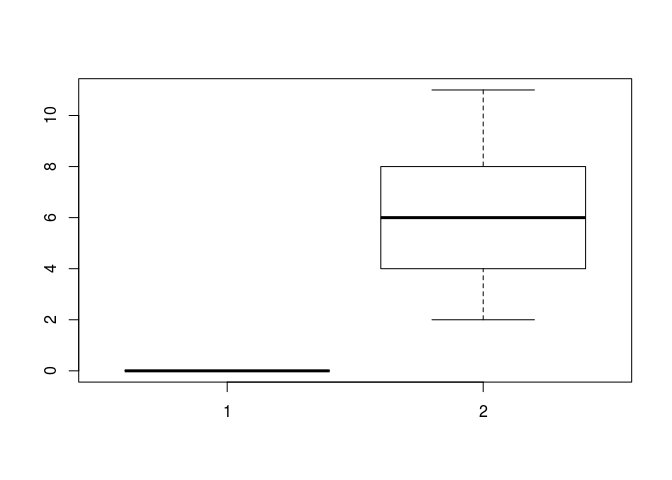
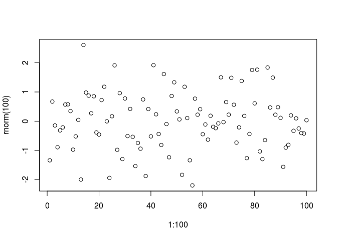
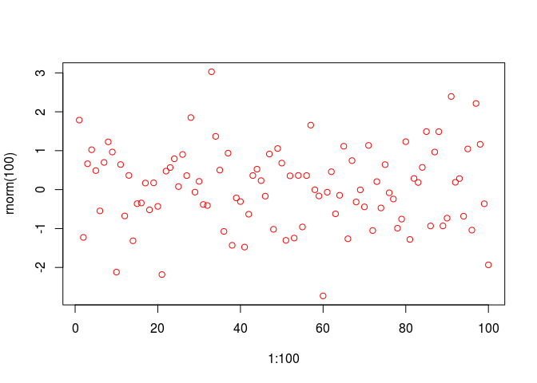
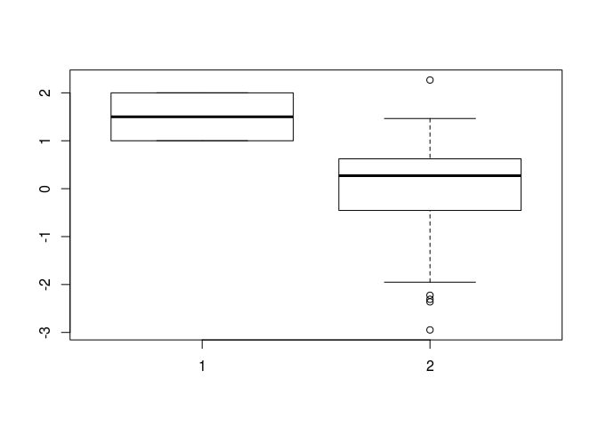

# SYSKA R and RStudio: Introduction and Accessing the Help system

This lesson is a recap of basic R with some coverage of the inner workings of functions, slices, and you they would be used. This includes a discussion of help systems within and beyond R. Various features of RStudio including "Projects", "Scripts", "Directory", "Environment", built-in "Help" and "Plotting" windows were also discussed.

We import the data using the following bash commands in Linux or Mac. For windows this can be done with "Git Bash" or by downloading the "zip" file from GitHub.


```bash
cd Downloads
git clone https://github.com/swcarpentry/r-novice-inflammation.git
```

Lesson Notes for Today, for further reference and examples to work through on your own:

http://swcarpentry.github.io/r-novice-inflammation/

The rest is a demonstration of R commands:


```r
#go to this folder
setwd("~/Downloads/r-novice-inflammation/")

#where am i?
getwd()
```

```
## [1] "/home/tomkelly/Downloads/r-novice-inflammation"
```

```r
?read.csv

#relative directory
read.csv("./data/inflammation-01.csv")
```

```
##    X0 X0.1 X1 X3 X1.1 X2 X4 X7 X8 X3.1 X3.2 X3.3 X10 X5 X7.1 X4.1 X7.2
## 1   0    1  2  1    2  1  3  2  2    6   10   11   5  9    4    4    7
## 2   0    1  1  3    3  2  6  2  5    9    5    7   4  5    4   15    5
## 3   0    0  2  0    4  2  2  1  6    7   10    7   9 13    8    8   15
## 4   0    1  1  3    3  1  3  5  2    4    4    7   6  5    3   10    8
## 5   0    0  1  2    2  4  2  1  6    4    7    6   6  9    9   15    4
## 6   0    0  2  2    4  2  2  5  5    8    6    5  11  9    4   13    5
## 7   0    0  1  2    3  1  2  3  5    3    7    8   8  5   10    9   15
## 8   0    0  0  3    1  5  6  5  5    8    2    4  11 12   10   11    9
## 9   0    1  1  2    1  3  5  3  5    8    6    8  12  5   13    6   13
## 10  0    1  0  0    4  3  3  5  5    4    5    8   7 10   13    3    7
## 11  0    1  0  0    3  4  2  7  8    5    2    8  11  5    5    8   14
## 12  0    0  2  1    4  3  6  4  6    7    9    9   3 11    6   12    4
## 13  0    0  0  0    1  3  1  6  6    5    5    6   3  6   13    3   10
## 14  0    1  2  1    1  1  4  1  5    2    3    3  10  7   13    5    7
## 15  0    1  1  0    1  2  4  3  6    4    7    5   5  7    5   10    7
## 16  0    0  0  0    2  3  6  5  7    4    3    2  10  7    9   11   12
## 17  0    0  0  1    2  1  4  3  6    7    4    2  12  6   12    4   14
## 18  0    0  2  1    2  5  4  2  7    8    4    7  11  9    8   11   15
## 19  0    1  2  0    1  4  3  2  2    7    3    3  12 13   11   13    6
## 20  0    1  1  3    1  4  4  1  8    2    2    3  12 12   10   15   13
## 21  0    0  2  3    2  3  2  6  3    8    7    4   6  6    9    5   12
## 22  0    0  0  3    4  5  1  7  7    8    2    5  12  4   10   14    5
## 23  0    1  1  1    1  3  3  2  6    3    9    7   8  8    4   13    7
## 24  0    1  1  1    2  3  5  3  6    3    7   10   3  8   12    4   12
## 25  0    0  2  1    3  3  2  7  4    4    3    8  12  9   12    9    5
## 26  0    0  1  2    4  2  2  3  5    7   10    5   5 12    3   13    4
## 27  0    0  1  1    1  5  1  5  2    2    4   10   4  8   14    6   15
## 28  0    0  2  2    3  4  6  3  7    6    4    5   8  4    7    7    6
## 29  0    0  0  1    4  4  6  3  8    6    4   10  12  3    3    6    8
## 30  0    1  1  0    3  2  4  6  8    6    2    3  11  3   14   14   12
## 31  0    0  2  3    3  4  5  3  6    7   10    5  10 13   14    3    8
## 32  0    1  2  2    2  3  6  6  6    7    6    3  11 12   13   15   15
## 33  0    0  2  1    3  5  6  7  5    8    9    3  12 10   12    4   12
## 34  0    0  1  2    4  1  5  5  2    3    4    8   8 12    5   15    9
## 35  0    0  0  3    1  3  6  4  3    4    8    3   4  8    3   11    5
## 36  0    1  2  2    2  5  5  1  4    6    3    6   5  9    6    7    4
## 37  0    1  1  2    3  1  5  1  2    2    5    7   6  6    5   10    6
## 38  0    1  0  3    2  4  1  1  5    9   10    7  12 10    9   15   12
## 39  0    1  1  3    1  1  5  5  3    7    2    2   3 12    4    6    8
## 40  0    0  0  2    2  1  3  4  5    5    6    5   5 12   13    5    7
## 41  0    0  1  3    3  1  2  1  8    9    2    8  10  3    8    6   10
## 42  0    1  1  3    4  5  2  1  3    7    9    6  10  5    8   15   11
## 43  0    0  1  3    1  4  3  6  7    8    5    7  11  3    6   11    6
## 44  0    1  1  3    3  4  4  6  3    4    9    9   7  6    8   15   12
## 45  0    1  2  2    4  3  1  4  8    9    5   10  10  3    4    6    7
## 46  0    0  2  3    4  5  4  6  2    9    7    4   9 10    8   11   16
## 47  0    1  1  3    1  4  6  2  8    2   10    3  11  9   13   15    5
## 48  0    0  1  3    2  5  1  2  7    6    6    3  12  9    4   14    4
## 49  0    0  1  2    3  4  5  7  5    4   10    5  12 12    5    4    7
## 50  0    1  2  1    1  3  5  3  6    3   10   10  11 10   13   10   13
## 51  0    1  2  2    3  5  2  4  5    6    8    3   5  4    3   15   15
## 52  0    0  0  2    4  4  5  3  3    3   10    4   4  4   14   11   15
## 53  0    0  2  1    1  4  4  7  2    9    4   10  12  7    6    6   11
## 54  0    1  2  1    1  4  5  4  4    5    9    7  10  3   13   13    8
## 55  0    0  1  3    2  3  6  4  5    7    2    4  11 11    3    8    8
## 56  0    1  1  2    2  5  1  7  4    2    5    5   4  6    6    4   16
## 57  0    1  1  1    4  1  6  4  6    3    6    5   6  4   14   13   13
## 58  0    0  0  1    4  5  6  3  8    7    9   10   8  6    5   12   15
## 59  0    0  1  0    3  2  5  4  8    2    9    3   3 10   12    9   14
##    X7.3 X12 X18 X6 X13 X11 X11.1 X7.4 X7.5 X4.2 X6.1 X8.1 X8.2 X4.3 X4.4
## 1    16   8   6 18   4  12     5   12    7   11    5   11    3    3    5
## 2    11   9  10 19  14  12    17    7   12   11    7    4    2   10    5
## 3    10  10   7 17   4   4     7    6   15    6    4    9   11    3    5
## 4    10   6  17  9  14   9     7   13    9   12    6    7    7    9    6
## 5    16  18  12 12   5  18     9    5    3   10    3   12    7    8    4
## 6    12  10   6  9  17  15     8    9    3   13    7    8    2    8    8
## 7    11  18  19 20   8   5    13   15   10    6   10    6    7    4    9
## 8    10  17  11  6  16  12     6    8   14    6   13   10   11    4    6
## 9     8  16   8 18  15  16    14   12    7    3    8    9   11    2    5
## 10   13  15  18  8  15  15    16   11   14   12    4   10   10    4    3
## 11   11   6  11  9  16  18     6   12    5    4    3    5    7    8    3
## 12   17  13  15 13  12   8     7    4    7   12    9    5    6    5    4
## 13   13   9  16 15   9  11     4    6    4   11   11   12    3    5    8
## 14   17   6   9 12  13  10     4   12    4    6    7    6   10    8    2
## 15    8  18  17  9   8  12    11   11   11   14    6   11    2   10    9
## 16    5  12   9 13  19  14    17    5   13    8   11    5   10    9    8
## 17    7   8  14 13  19   6     9   12    6    4   13    6    7    2    3
## 18   17  11  12  7  12   7     6    7    4   13    5    7    6    6    9
## 19    5   9  16  9  19  16    11    8    9   14   12   11    9    6    6
## 20    6   5   5 18  19   9     6   11   12    7    6    3    6    3    2
## 21   12   8   5 12  10  16     7   14   12    5    4    6    9    8    5
## 22    5  17  13 16  15  13     6   12    9   10    3    3    7    4    4
## 23   14  11  15 14  13   5    13    7   14    9   10    5   11    5    3
## 24    9  15   5 17  16   5    10   10   15    7    5    3   11    5    5
## 25   16   8  17  7  11  14     7   13   11    7   12   12    7    8    5
## 26   13   7  15  9  12  18    14   16   12    3   11    3    2    7    4
## 27    6  12  15 15  13   7    17    4    5   11    4    8    7    9    4
## 28   11  12  19 20  18   9     5    4    7   14    8    4    3    7    7
## 29    7  17  16 14  15  17     4   14   13    4    4   12   11    6    9
## 30    8   8  16 13   7   6     9   15    7    6    4   10    8   10    4
## 31   10   9   9 19  15  15     6    8    8   11    5    5    7    3    6
## 32   10  14  11 11   8   6    12   10    5   12    7    7   11    5    8
## 33    9  13  10 10   6  10    11    4   15   13    7    3    4    2    9
## 34   17   7  19 14  18  12    17   14    4   13   13    8   11    5    6
## 35    7  10   5 15   9  16    17   16    3    8    9    8    3    3    9
## 36    7  16   7 16  13   9    16   12    6    7    9   10    3    6    4
## 37    7  17  13 15  16  17    14    4    4   10   10   10   11    9    9
## 38   13  13   6 19   9  10     6   13    5   13    6    7    2    5    5
## 39   15  16  16 15   4  14     5   13   10    7   10    6    3    2    3
## 40    5  11  15 18   7   9    10   14   12   11    9   10    3    2    9
## 41   13  11  17 19   6   4    11    6   12    7    5    5    4    4    8
## 42   12  15   6 12  16   6     4   14    3   12    9    6   11    5    8
## 43   10   6  19 18  14   6    10    7    9    8    5    8    3   10    2
## 44   15   6  11  6  18   5    14   15   12    9    8    3    6   10    6
## 45   11  16   6 14   9  11    10   10    7   10    8    8    4    5    8
## 46   12  15  17 19  10  18    13   15   11    8    4    7   11    6    7
## 47   15   6  10 10   5  14    15   12    7    4    5   11    4    6    9
## 48    6  12   9 12   7  11     7   16    8   13    6    7    6   10    7
## 49    9  18  16 16  10  15    15   10    4    3    7    5    9    4    6
## 50    6   6  14  5   4   5     5    9    4   12    7    7    4    7    9
## 51   12  16   7 20  15  12     8    9    6   12    5    8    3    8    5
## 52   13  10  14 11  17   9    11   11    7   10   12   10   10   10    8
## 53   12   9  15 15   6   6    13    5   12    9    6    4    7    7    6
## 54    9  17  16 16  15  12    13    5   12   10    9   11    9    4    5
## 55   16   5  13 16   5   8     8    6    9   10   10    9    3    3    5
## 56   11  14  16 14  14   8    17    4   14   13    7    6    3    7    7
## 57    9  12  19  9  10  15    10    9   10   10    7    5    6    8    6
## 58    5  10   5  8  13  18    17   14    9   13    4   10   11   10    8
## 59   11  13   8  6  18  11     9   13   11    8    5    5    2    8    5
##    X5.1 X7.6 X3.4 X4.5 X2.1 X3.5 X0.2 X0.3
## 1     4    4    5    5    1    1    0    1
## 2     4    2    2    3    2    2    1    1
## 3     6    3    3    4    2    3    2    1
## 4     3    2    2    4    2    0    1    1
## 5     7    3    5    4    4    3    2    1
## 6     4    2    3    5    4    1    1    1
## 7     3    5    2    5    3    2    2    1
## 8     4    7    6    3    2    1    0    0
## 9     4    5    1    4    1    2    0    0
## 10    4    5    5    3    3    2    2    1
## 11    5    4    5    5    4    0    1    1
## 12    7    3    5    4    2    3    0    1
## 13    7    4    6    4    1    3    0    0
## 14    5    1    3    4    2    0    2    0
## 15    5    6    5    3    4    2    2    0
## 16    7    5    3    1    4    0    2    1
## 17    6    5    4    2    3    0    1    0
## 18    2    1    1    2    2    0    1    0
## 19    6    1    1    2    4    3    1    1
## 20    4    3    1    5    4    2    2    0
## 21    6    6    1    4    3    0    2    0
## 22    8    2    6    5    1    0    1    0
## 23    5    1    1    4    4    1    2    0
## 24    6    1    1    1    1    0    2    1
## 25    7    2    2    4    1    1    1    0
## 26    8    2    2    1    3    0    1    1
## 27    5    3    2    5    4    3    2    1
## 28    8    3    5    4    1    3    1    0
## 29    5    5    2    5    2    1    0    1
## 30    2    6    5    5    2    3    2    1
## 31    6    4    5    2    2    3    0    0
## 32    5    2    5    5    2    0    2    1
## 33    7    2    4    2    1    2    1    1
## 34    6    2    3    5    2    1    1    1
## 35    5    1    6    5    4    2    2    0
## 36    5    4    6    3    4    3    2    1
## 37    5    4    4    2    1    0    1    0
## 38    2    1    1    1    1    3    0    1
## 39    6    3    3    5    4    3    2    1
## 40    6    2    2    5    3    0    0    1
## 41    2    6    6    4    2    2    0    0
## 42    5    5    6    1    2    1    2    0
## 43    5    1    5    4    2    1    0    1
## 44    8    7    2    5    4    3    1    1
## 45    4    4    5    2    4    1    1    0
## 46    6    5    1    3    1    0    0    0
## 47    5    6    1    1    2    1    2    1
## 48    6    3    1    5    4    3    0    0
## 49    2    4    1    4    2    2    2    1
## 50    3    3    6    3    4    1    2    0
## 51    4    1    3    2    1    3    1    0
## 52    7    5    2    2    4    1    2    1
## 53    5    4    1    4    2    2    2    1
## 54    5    2    2    5    1    0    0    1
## 55    3    5    4    5    3    3    0    1
## 56    5    6    3    4    2    2    1    1
## 57    6    4    3    5    2    1    1    1
## 58    8    6    5    5    2    0    2    0
## 59    3    5    4    1    3    1    1    0
```

```r
#absolute directory
read.csv("~/Downloads/r-novice-inflammation/data/inflammation-01.csv")
```

```
##    X0 X0.1 X1 X3 X1.1 X2 X4 X7 X8 X3.1 X3.2 X3.3 X10 X5 X7.1 X4.1 X7.2
## 1   0    1  2  1    2  1  3  2  2    6   10   11   5  9    4    4    7
## 2   0    1  1  3    3  2  6  2  5    9    5    7   4  5    4   15    5
## 3   0    0  2  0    4  2  2  1  6    7   10    7   9 13    8    8   15
## 4   0    1  1  3    3  1  3  5  2    4    4    7   6  5    3   10    8
## 5   0    0  1  2    2  4  2  1  6    4    7    6   6  9    9   15    4
## 6   0    0  2  2    4  2  2  5  5    8    6    5  11  9    4   13    5
## 7   0    0  1  2    3  1  2  3  5    3    7    8   8  5   10    9   15
## 8   0    0  0  3    1  5  6  5  5    8    2    4  11 12   10   11    9
## 9   0    1  1  2    1  3  5  3  5    8    6    8  12  5   13    6   13
## 10  0    1  0  0    4  3  3  5  5    4    5    8   7 10   13    3    7
## 11  0    1  0  0    3  4  2  7  8    5    2    8  11  5    5    8   14
## 12  0    0  2  1    4  3  6  4  6    7    9    9   3 11    6   12    4
## 13  0    0  0  0    1  3  1  6  6    5    5    6   3  6   13    3   10
## 14  0    1  2  1    1  1  4  1  5    2    3    3  10  7   13    5    7
## 15  0    1  1  0    1  2  4  3  6    4    7    5   5  7    5   10    7
## 16  0    0  0  0    2  3  6  5  7    4    3    2  10  7    9   11   12
## 17  0    0  0  1    2  1  4  3  6    7    4    2  12  6   12    4   14
## 18  0    0  2  1    2  5  4  2  7    8    4    7  11  9    8   11   15
## 19  0    1  2  0    1  4  3  2  2    7    3    3  12 13   11   13    6
## 20  0    1  1  3    1  4  4  1  8    2    2    3  12 12   10   15   13
## 21  0    0  2  3    2  3  2  6  3    8    7    4   6  6    9    5   12
## 22  0    0  0  3    4  5  1  7  7    8    2    5  12  4   10   14    5
## 23  0    1  1  1    1  3  3  2  6    3    9    7   8  8    4   13    7
## 24  0    1  1  1    2  3  5  3  6    3    7   10   3  8   12    4   12
## 25  0    0  2  1    3  3  2  7  4    4    3    8  12  9   12    9    5
## 26  0    0  1  2    4  2  2  3  5    7   10    5   5 12    3   13    4
## 27  0    0  1  1    1  5  1  5  2    2    4   10   4  8   14    6   15
## 28  0    0  2  2    3  4  6  3  7    6    4    5   8  4    7    7    6
## 29  0    0  0  1    4  4  6  3  8    6    4   10  12  3    3    6    8
## 30  0    1  1  0    3  2  4  6  8    6    2    3  11  3   14   14   12
## 31  0    0  2  3    3  4  5  3  6    7   10    5  10 13   14    3    8
## 32  0    1  2  2    2  3  6  6  6    7    6    3  11 12   13   15   15
## 33  0    0  2  1    3  5  6  7  5    8    9    3  12 10   12    4   12
## 34  0    0  1  2    4  1  5  5  2    3    4    8   8 12    5   15    9
## 35  0    0  0  3    1  3  6  4  3    4    8    3   4  8    3   11    5
## 36  0    1  2  2    2  5  5  1  4    6    3    6   5  9    6    7    4
## 37  0    1  1  2    3  1  5  1  2    2    5    7   6  6    5   10    6
## 38  0    1  0  3    2  4  1  1  5    9   10    7  12 10    9   15   12
## 39  0    1  1  3    1  1  5  5  3    7    2    2   3 12    4    6    8
## 40  0    0  0  2    2  1  3  4  5    5    6    5   5 12   13    5    7
## 41  0    0  1  3    3  1  2  1  8    9    2    8  10  3    8    6   10
## 42  0    1  1  3    4  5  2  1  3    7    9    6  10  5    8   15   11
## 43  0    0  1  3    1  4  3  6  7    8    5    7  11  3    6   11    6
## 44  0    1  1  3    3  4  4  6  3    4    9    9   7  6    8   15   12
## 45  0    1  2  2    4  3  1  4  8    9    5   10  10  3    4    6    7
## 46  0    0  2  3    4  5  4  6  2    9    7    4   9 10    8   11   16
## 47  0    1  1  3    1  4  6  2  8    2   10    3  11  9   13   15    5
## 48  0    0  1  3    2  5  1  2  7    6    6    3  12  9    4   14    4
## 49  0    0  1  2    3  4  5  7  5    4   10    5  12 12    5    4    7
## 50  0    1  2  1    1  3  5  3  6    3   10   10  11 10   13   10   13
## 51  0    1  2  2    3  5  2  4  5    6    8    3   5  4    3   15   15
## 52  0    0  0  2    4  4  5  3  3    3   10    4   4  4   14   11   15
## 53  0    0  2  1    1  4  4  7  2    9    4   10  12  7    6    6   11
## 54  0    1  2  1    1  4  5  4  4    5    9    7  10  3   13   13    8
## 55  0    0  1  3    2  3  6  4  5    7    2    4  11 11    3    8    8
## 56  0    1  1  2    2  5  1  7  4    2    5    5   4  6    6    4   16
## 57  0    1  1  1    4  1  6  4  6    3    6    5   6  4   14   13   13
## 58  0    0  0  1    4  5  6  3  8    7    9   10   8  6    5   12   15
## 59  0    0  1  0    3  2  5  4  8    2    9    3   3 10   12    9   14
##    X7.3 X12 X18 X6 X13 X11 X11.1 X7.4 X7.5 X4.2 X6.1 X8.1 X8.2 X4.3 X4.4
## 1    16   8   6 18   4  12     5   12    7   11    5   11    3    3    5
## 2    11   9  10 19  14  12    17    7   12   11    7    4    2   10    5
## 3    10  10   7 17   4   4     7    6   15    6    4    9   11    3    5
## 4    10   6  17  9  14   9     7   13    9   12    6    7    7    9    6
## 5    16  18  12 12   5  18     9    5    3   10    3   12    7    8    4
## 6    12  10   6  9  17  15     8    9    3   13    7    8    2    8    8
## 7    11  18  19 20   8   5    13   15   10    6   10    6    7    4    9
## 8    10  17  11  6  16  12     6    8   14    6   13   10   11    4    6
## 9     8  16   8 18  15  16    14   12    7    3    8    9   11    2    5
## 10   13  15  18  8  15  15    16   11   14   12    4   10   10    4    3
## 11   11   6  11  9  16  18     6   12    5    4    3    5    7    8    3
## 12   17  13  15 13  12   8     7    4    7   12    9    5    6    5    4
## 13   13   9  16 15   9  11     4    6    4   11   11   12    3    5    8
## 14   17   6   9 12  13  10     4   12    4    6    7    6   10    8    2
## 15    8  18  17  9   8  12    11   11   11   14    6   11    2   10    9
## 16    5  12   9 13  19  14    17    5   13    8   11    5   10    9    8
## 17    7   8  14 13  19   6     9   12    6    4   13    6    7    2    3
## 18   17  11  12  7  12   7     6    7    4   13    5    7    6    6    9
## 19    5   9  16  9  19  16    11    8    9   14   12   11    9    6    6
## 20    6   5   5 18  19   9     6   11   12    7    6    3    6    3    2
## 21   12   8   5 12  10  16     7   14   12    5    4    6    9    8    5
## 22    5  17  13 16  15  13     6   12    9   10    3    3    7    4    4
## 23   14  11  15 14  13   5    13    7   14    9   10    5   11    5    3
## 24    9  15   5 17  16   5    10   10   15    7    5    3   11    5    5
## 25   16   8  17  7  11  14     7   13   11    7   12   12    7    8    5
## 26   13   7  15  9  12  18    14   16   12    3   11    3    2    7    4
## 27    6  12  15 15  13   7    17    4    5   11    4    8    7    9    4
## 28   11  12  19 20  18   9     5    4    7   14    8    4    3    7    7
## 29    7  17  16 14  15  17     4   14   13    4    4   12   11    6    9
## 30    8   8  16 13   7   6     9   15    7    6    4   10    8   10    4
## 31   10   9   9 19  15  15     6    8    8   11    5    5    7    3    6
## 32   10  14  11 11   8   6    12   10    5   12    7    7   11    5    8
## 33    9  13  10 10   6  10    11    4   15   13    7    3    4    2    9
## 34   17   7  19 14  18  12    17   14    4   13   13    8   11    5    6
## 35    7  10   5 15   9  16    17   16    3    8    9    8    3    3    9
## 36    7  16   7 16  13   9    16   12    6    7    9   10    3    6    4
## 37    7  17  13 15  16  17    14    4    4   10   10   10   11    9    9
## 38   13  13   6 19   9  10     6   13    5   13    6    7    2    5    5
## 39   15  16  16 15   4  14     5   13   10    7   10    6    3    2    3
## 40    5  11  15 18   7   9    10   14   12   11    9   10    3    2    9
## 41   13  11  17 19   6   4    11    6   12    7    5    5    4    4    8
## 42   12  15   6 12  16   6     4   14    3   12    9    6   11    5    8
## 43   10   6  19 18  14   6    10    7    9    8    5    8    3   10    2
## 44   15   6  11  6  18   5    14   15   12    9    8    3    6   10    6
## 45   11  16   6 14   9  11    10   10    7   10    8    8    4    5    8
## 46   12  15  17 19  10  18    13   15   11    8    4    7   11    6    7
## 47   15   6  10 10   5  14    15   12    7    4    5   11    4    6    9
## 48    6  12   9 12   7  11     7   16    8   13    6    7    6   10    7
## 49    9  18  16 16  10  15    15   10    4    3    7    5    9    4    6
## 50    6   6  14  5   4   5     5    9    4   12    7    7    4    7    9
## 51   12  16   7 20  15  12     8    9    6   12    5    8    3    8    5
## 52   13  10  14 11  17   9    11   11    7   10   12   10   10   10    8
## 53   12   9  15 15   6   6    13    5   12    9    6    4    7    7    6
## 54    9  17  16 16  15  12    13    5   12   10    9   11    9    4    5
## 55   16   5  13 16   5   8     8    6    9   10   10    9    3    3    5
## 56   11  14  16 14  14   8    17    4   14   13    7    6    3    7    7
## 57    9  12  19  9  10  15    10    9   10   10    7    5    6    8    6
## 58    5  10   5  8  13  18    17   14    9   13    4   10   11   10    8
## 59   11  13   8  6  18  11     9   13   11    8    5    5    2    8    5
##    X5.1 X7.6 X3.4 X4.5 X2.1 X3.5 X0.2 X0.3
## 1     4    4    5    5    1    1    0    1
## 2     4    2    2    3    2    2    1    1
## 3     6    3    3    4    2    3    2    1
## 4     3    2    2    4    2    0    1    1
## 5     7    3    5    4    4    3    2    1
## 6     4    2    3    5    4    1    1    1
## 7     3    5    2    5    3    2    2    1
## 8     4    7    6    3    2    1    0    0
## 9     4    5    1    4    1    2    0    0
## 10    4    5    5    3    3    2    2    1
## 11    5    4    5    5    4    0    1    1
## 12    7    3    5    4    2    3    0    1
## 13    7    4    6    4    1    3    0    0
## 14    5    1    3    4    2    0    2    0
## 15    5    6    5    3    4    2    2    0
## 16    7    5    3    1    4    0    2    1
## 17    6    5    4    2    3    0    1    0
## 18    2    1    1    2    2    0    1    0
## 19    6    1    1    2    4    3    1    1
## 20    4    3    1    5    4    2    2    0
## 21    6    6    1    4    3    0    2    0
## 22    8    2    6    5    1    0    1    0
## 23    5    1    1    4    4    1    2    0
## 24    6    1    1    1    1    0    2    1
## 25    7    2    2    4    1    1    1    0
## 26    8    2    2    1    3    0    1    1
## 27    5    3    2    5    4    3    2    1
## 28    8    3    5    4    1    3    1    0
## 29    5    5    2    5    2    1    0    1
## 30    2    6    5    5    2    3    2    1
## 31    6    4    5    2    2    3    0    0
## 32    5    2    5    5    2    0    2    1
## 33    7    2    4    2    1    2    1    1
## 34    6    2    3    5    2    1    1    1
## 35    5    1    6    5    4    2    2    0
## 36    5    4    6    3    4    3    2    1
## 37    5    4    4    2    1    0    1    0
## 38    2    1    1    1    1    3    0    1
## 39    6    3    3    5    4    3    2    1
## 40    6    2    2    5    3    0    0    1
## 41    2    6    6    4    2    2    0    0
## 42    5    5    6    1    2    1    2    0
## 43    5    1    5    4    2    1    0    1
## 44    8    7    2    5    4    3    1    1
## 45    4    4    5    2    4    1    1    0
## 46    6    5    1    3    1    0    0    0
## 47    5    6    1    1    2    1    2    1
## 48    6    3    1    5    4    3    0    0
## 49    2    4    1    4    2    2    2    1
## 50    3    3    6    3    4    1    2    0
## 51    4    1    3    2    1    3    1    0
## 52    7    5    2    2    4    1    2    1
## 53    5    4    1    4    2    2    2    1
## 54    5    2    2    5    1    0    0    1
## 55    3    5    4    5    3    3    0    1
## 56    5    6    3    4    2    2    1    1
## 57    6    4    3    5    2    1    1    1
## 58    8    6    5    5    2    0    2    0
## 59    3    5    4    1    3    1    1    0
```

```r
#setting variable
x <- 5
x
```

```
## [1] 5
```

```r
y <- x +1

data <- read.csv("./data/inflammation-01.csv")
head(data)
```

```
##   X0 X0.1 X1 X3 X1.1 X2 X4 X7 X8 X3.1 X3.2 X3.3 X10 X5 X7.1 X4.1 X7.2 X7.3
## 1  0    1  2  1    2  1  3  2  2    6   10   11   5  9    4    4    7   16
## 2  0    1  1  3    3  2  6  2  5    9    5    7   4  5    4   15    5   11
## 3  0    0  2  0    4  2  2  1  6    7   10    7   9 13    8    8   15   10
## 4  0    1  1  3    3  1  3  5  2    4    4    7   6  5    3   10    8   10
## 5  0    0  1  2    2  4  2  1  6    4    7    6   6  9    9   15    4   16
## 6  0    0  2  2    4  2  2  5  5    8    6    5  11  9    4   13    5   12
##   X12 X18 X6 X13 X11 X11.1 X7.4 X7.5 X4.2 X6.1 X8.1 X8.2 X4.3 X4.4 X5.1
## 1   8   6 18   4  12     5   12    7   11    5   11    3    3    5    4
## 2   9  10 19  14  12    17    7   12   11    7    4    2   10    5    4
## 3  10   7 17   4   4     7    6   15    6    4    9   11    3    5    6
## 4   6  17  9  14   9     7   13    9   12    6    7    7    9    6    3
## 5  18  12 12   5  18     9    5    3   10    3   12    7    8    4    7
## 6  10   6  9  17  15     8    9    3   13    7    8    2    8    8    4
##   X7.6 X3.4 X4.5 X2.1 X3.5 X0.2 X0.3
## 1    4    5    5    1    1    0    1
## 2    2    2    3    2    2    1    1
## 3    3    3    4    2    3    2    1
## 4    2    2    4    2    0    1    1
## 5    3    5    4    4    3    2    1
## 6    2    3    5    4    1    1    1
```

```r
dim(data)
```

```
## [1] 59 40
```

```r
colnames(data)
```

```
##  [1] "X0"    "X0.1"  "X1"    "X3"    "X1.1"  "X2"    "X4"    "X7"   
##  [9] "X8"    "X3.1"  "X3.2"  "X3.3"  "X10"   "X5"    "X7.1"  "X4.1" 
## [17] "X7.2"  "X7.3"  "X12"   "X18"   "X6"    "X13"   "X11"   "X11.1"
## [25] "X7.4"  "X7.5"  "X4.2"  "X6.1"  "X8.1"  "X8.2"  "X4.3"  "X4.4" 
## [33] "X5.1"  "X7.6"  "X3.4"  "X4.5"  "X2.1"  "X3.5"  "X0.2"  "X0.3"
```

```r
#slices
data[1:5,5]
```

```
## [1] 2 3 4 3 2
```

```r
#generally the syntax is:
data[row_numbers, col_numbers]
```

```r
#column by name
data$X0
```

```
##  [1] 0 0 0 0 0 0 0 0 0 0 0 0 0 0 0 0 0 0 0 0 0 0 0 0 0 0 0 0 0 0 0 0 0 0 0
## [36] 0 0 0 0 0 0 0 0 0 0 0 0 0 0 0 0 0 0 0 0 0 0 0 0
```

```r
data[,"X0"]
```

```
##  [1] 0 0 0 0 0 0 0 0 0 0 0 0 0 0 0 0 0 0 0 0 0 0 0 0 0 0 0 0 0 0 0 0 0 0 0
## [36] 0 0 0 0 0 0 0 0 0 0 0 0 0 0 0 0 0 0 0 0 0 0 0 0
```

```r
cor(data$X0, data$X3.3)
```

```
## Warning in cor(data$X0, data$X3.3): the standard deviation is zero
```

```
## [1] NA
```

```r
t.test(data$X0, data$X3.3)
```

```
## 
## 	Welch Two Sample t-test
## 
## data:  data$X0 and data$X3.3
## t = -18.121, df = 58, p-value < 2.2e-16
## alternative hypothesis: true difference in means is not equal to 0
## 95 percent confidence interval:
##  -6.606335 -5.291970
## sample estimates:
## mean of x mean of y 
##  0.000000  5.949153
```

```r
boxplot(data$X0, data$X3.3)
```

<!-- -->

```r
plot(1:100, rnorm(100))
```

<!-- -->

```r
plot(1:100, rnorm(100), col="red")
```

<!-- -->

```r
boxplot(rep(1:2, 50), rnorm(100))
```

<!-- -->

```r
#sequences
1:5
```

```
## [1] 1 2 3 4 5
```

```r
c(1,2,3,4,5)
```

```
## [1] 1 2 3 4 5
```

```r
seq(1,5)
```

```
## [1] 1 2 3 4 5
```

```r
seq(1,500)
```

```
##   [1]   1   2   3   4   5   6   7   8   9  10  11  12  13  14  15  16  17
##  [18]  18  19  20  21  22  23  24  25  26  27  28  29  30  31  32  33  34
##  [35]  35  36  37  38  39  40  41  42  43  44  45  46  47  48  49  50  51
##  [52]  52  53  54  55  56  57  58  59  60  61  62  63  64  65  66  67  68
##  [69]  69  70  71  72  73  74  75  76  77  78  79  80  81  82  83  84  85
##  [86]  86  87  88  89  90  91  92  93  94  95  96  97  98  99 100 101 102
## [103] 103 104 105 106 107 108 109 110 111 112 113 114 115 116 117 118 119
## [120] 120 121 122 123 124 125 126 127 128 129 130 131 132 133 134 135 136
## [137] 137 138 139 140 141 142 143 144 145 146 147 148 149 150 151 152 153
## [154] 154 155 156 157 158 159 160 161 162 163 164 165 166 167 168 169 170
## [171] 171 172 173 174 175 176 177 178 179 180 181 182 183 184 185 186 187
## [188] 188 189 190 191 192 193 194 195 196 197 198 199 200 201 202 203 204
## [205] 205 206 207 208 209 210 211 212 213 214 215 216 217 218 219 220 221
## [222] 222 223 224 225 226 227 228 229 230 231 232 233 234 235 236 237 238
## [239] 239 240 241 242 243 244 245 246 247 248 249 250 251 252 253 254 255
## [256] 256 257 258 259 260 261 262 263 264 265 266 267 268 269 270 271 272
## [273] 273 274 275 276 277 278 279 280 281 282 283 284 285 286 287 288 289
## [290] 290 291 292 293 294 295 296 297 298 299 300 301 302 303 304 305 306
## [307] 307 308 309 310 311 312 313 314 315 316 317 318 319 320 321 322 323
## [324] 324 325 326 327 328 329 330 331 332 333 334 335 336 337 338 339 340
## [341] 341 342 343 344 345 346 347 348 349 350 351 352 353 354 355 356 357
## [358] 358 359 360 361 362 363 364 365 366 367 368 369 370 371 372 373 374
## [375] 375 376 377 378 379 380 381 382 383 384 385 386 387 388 389 390 391
## [392] 392 393 394 395 396 397 398 399 400 401 402 403 404 405 406 407 408
## [409] 409 410 411 412 413 414 415 416 417 418 419 420 421 422 423 424 425
## [426] 426 427 428 429 430 431 432 433 434 435 436 437 438 439 440 441 442
## [443] 443 444 445 446 447 448 449 450 451 452 453 454 455 456 457 458 459
## [460] 460 461 462 463 464 465 466 467 468 469 470 471 472 473 474 475 476
## [477] 477 478 479 480 481 482 483 484 485 486 487 488 489 490 491 492 493
## [494] 494 495 496 497 498 499 500
```

```r
seq(1,500,2)
```

```
##   [1]   1   3   5   7   9  11  13  15  17  19  21  23  25  27  29  31  33
##  [18]  35  37  39  41  43  45  47  49  51  53  55  57  59  61  63  65  67
##  [35]  69  71  73  75  77  79  81  83  85  87  89  91  93  95  97  99 101
##  [52] 103 105 107 109 111 113 115 117 119 121 123 125 127 129 131 133 135
##  [69] 137 139 141 143 145 147 149 151 153 155 157 159 161 163 165 167 169
##  [86] 171 173 175 177 179 181 183 185 187 189 191 193 195 197 199 201 203
## [103] 205 207 209 211 213 215 217 219 221 223 225 227 229 231 233 235 237
## [120] 239 241 243 245 247 249 251 253 255 257 259 261 263 265 267 269 271
## [137] 273 275 277 279 281 283 285 287 289 291 293 295 297 299 301 303 305
## [154] 307 309 311 313 315 317 319 321 323 325 327 329 331 333 335 337 339
## [171] 341 343 345 347 349 351 353 355 357 359 361 363 365 367 369 371 373
## [188] 375 377 379 381 383 385 387 389 391 393 395 397 399 401 403 405 407
## [205] 409 411 413 415 417 419 421 423 425 427 429 431 433 435 437 439 441
## [222] 443 445 447 449 451 453 455 457 459 461 463 465 467 469 471 473 475
## [239] 477 479 481 483 485 487 489 491 493 495 497 499
```

```r
rep(1, 20)
```

```
##  [1] 1 1 1 1 1 1 1 1 1 1 1 1 1 1 1 1 1 1 1 1
```

```r
#vectorization
x <- c(1,2,3,4,5)
2 * x
```

```
## [1]  2  4  6  8 10
```

```r
for(i in 1:length(x)){
  print(x[i]*2)
}
```

```
## [1] 2
## [1] 4
## [1] 6
## [1] 8
## [1] 10
```

```r
sum(x)
```

```
## [1] 15
```

```r
sum(data[,1])
```

```
## [1] 0
```

```r
sum(data[,2])
```

```
## [1] 27
```

```r
sum(data[,3])
```

```
## [1] 66
```

```r
sum(data[,5])
```

```
## [1] 145
```

```r
dim(data)
```

```
## [1] 59 40
```

```r
apply(data, 2, sum)
```

```
##    X0  X0.1    X1    X3  X1.1    X2    X4    X7    X8  X3.1  X3.2  X3.3 
##     0    27    66   102   145   187   224   226   306   328   354   351 
##   X10    X5  X7.1  X4.1  X7.2  X7.3   X12   X18    X6   X13   X11 X11.1 
##   491   459   495   566   568   631   682   723   789   705   651   599 
##  X7.4  X7.5  X4.2  X6.1  X8.1  X8.2  X4.3  X4.4  X5.1  X7.6  X3.4  X4.5 
##   593   513   545   429   432   387   360   353   302   209   195   210 
##  X2.1  X3.5  X0.2  X0.3 
##   147    87    68    34
```

```r
apply(data, 1, sum)
```

```
##  [1] 217 244 236 222 249 239 266 265 261 271 232 249 230 209 252 262 228
## [18] 234 262 231 233 247 244 232 257 242 241 247 262 247 254 269 245 283
## [35] 229 237 246 243 230 239 229 252 236 270 237 289 246 238 251 228 244
## [52] 273 239 269 228 250 256 282 236
```

```r
#Note that the above implicitly specifies the arguments in order:
apply(X=data, MARGIN=1, FUN=sum)
```

```
##  [1] 217 244 236 222 249 239 266 265 261 271 232 249 230 209 252 262 228
## [18] 234 262 231 233 247 244 232 257 242 241 247 262 247 254 269 245 283
## [35] 229 237 246 243 230 239 229 252 236 270 237 289 246 238 251 228 244
## [52] 273 239 269 228 250 256 282 236
```

```r
#Re-ordering the arguments doesn't work:
apply(data, sum, 1)
```

```r
#Reordering with the arguments names explicitly does work:
apply(X=data, FUN=sum, MARGIN=1)
```

```
##  [1] 217 244 236 222 249 239 266 265 261 271 232 249 230 209 252 262 228
## [18] 234 262 231 233 247 244 232 257 242 241 247 262 247 254 269 245 283
## [35] 229 237 246 243 230 239 229 252 236 270 237 289 246 238 251 228 244
## [52] 273 239 269 228 250 256 282 236
```

```r
?apply

for(i in 1:ncol(data)){
  x <- data[,i]
  print(sum(x))
}
```

```
## [1] 0
## [1] 27
## [1] 66
## [1] 102
## [1] 145
## [1] 187
## [1] 224
## [1] 226
## [1] 306
## [1] 328
## [1] 354
## [1] 351
## [1] 491
## [1] 459
## [1] 495
## [1] 566
## [1] 568
## [1] 631
## [1] 682
## [1] 723
## [1] 789
## [1] 705
## [1] 651
## [1] 599
## [1] 593
## [1] 513
## [1] 545
## [1] 429
## [1] 432
## [1] 387
## [1] 360
## [1] 353
## [1] 302
## [1] 209
## [1] 195
## [1] 210
## [1] 147
## [1] 87
## [1] 68
## [1] 34
```

```r
ma <- matrix(c(1:4, 1, 6:8), nrow = 2)
ma
```

```
##      [,1] [,2] [,3] [,4]
## [1,]    1    3    1    7
## [2,]    2    4    6    8
```

```r
apply(ma, 1, table)
```

```
## [[1]]
## 
## 1 3 7 
## 2 1 1 
## 
## [[2]]
## 
## 2 4 6 8 
## 1 1 1 1
```

```r
sum(1:2)
```

```
## [1] 3
```

```r
sum
```

```
## function (..., na.rm = FALSE)  .Primitive("sum")
```

```r
?sum

min(1:2)
```

```
## [1] 1
```

```r
min
```

```
## function (..., na.rm = FALSE)  .Primitive("min")
```

```r
?min

max(1:2)
```

```
## [1] 2
```

```r
max
```

```
## function (..., na.rm = FALSE)  .Primitive("max")
```

```r
?max

mean(1:100)
```

```
## [1] 50.5
```

```r
#help
?average
```

```
## No documentation for 'average' in specified packages and libraries:
## you could try '??average'
```

```r
#search
??average

#write own functions

square_number <- function(x){
  x <- y
  if(y<0){
    y <- -y # make positive
  }
  z <- y^2 #square number
  return(z)
}

square_number <- function(x) x^2


square_number
```

```
## function(x) x^2
```

```r
?square_number
```

```
## No documentation for 'square_number' in specified packages and libraries:
## you could try '??square_number'
```

```r
#test
square_number(1)
```

```
## [1] 1
```

```r
square_number(2)
```

```
## [1] 4
```

```r
square_number(-1)
```

```
## [1] 1
```

```r
square_number(0)
```

```
## [1] 0
```

```r
#notice that this function will not work if input is not a number:
square_number("a")
```

```r
square_number(data)
```

```
##       X0 X0.1 X1 X3 X1.1 X2 X4 X7 X8 X3.1 X3.2 X3.3 X10  X5 X7.1 X4.1 X7.2
##  [1,]  0    1  4  1    4  1  9  4  4   36  100  121  25  81   16   16   49
##  [2,]  0    1  1  9    9  4 36  4 25   81   25   49  16  25   16  225   25
##  [3,]  0    0  4  0   16  4  4  1 36   49  100   49  81 169   64   64  225
##  [4,]  0    1  1  9    9  1  9 25  4   16   16   49  36  25    9  100   64
##  [5,]  0    0  1  4    4 16  4  1 36   16   49   36  36  81   81  225   16
##  [6,]  0    0  4  4   16  4  4 25 25   64   36   25 121  81   16  169   25
##  [7,]  0    0  1  4    9  1  4  9 25    9   49   64  64  25  100   81  225
##  [8,]  0    0  0  9    1 25 36 25 25   64    4   16 121 144  100  121   81
##  [9,]  0    1  1  4    1  9 25  9 25   64   36   64 144  25  169   36  169
## [10,]  0    1  0  0   16  9  9 25 25   16   25   64  49 100  169    9   49
## [11,]  0    1  0  0    9 16  4 49 64   25    4   64 121  25   25   64  196
## [12,]  0    0  4  1   16  9 36 16 36   49   81   81   9 121   36  144   16
## [13,]  0    0  0  0    1  9  1 36 36   25   25   36   9  36  169    9  100
## [14,]  0    1  4  1    1  1 16  1 25    4    9    9 100  49  169   25   49
## [15,]  0    1  1  0    1  4 16  9 36   16   49   25  25  49   25  100   49
## [16,]  0    0  0  0    4  9 36 25 49   16    9    4 100  49   81  121  144
## [17,]  0    0  0  1    4  1 16  9 36   49   16    4 144  36  144   16  196
## [18,]  0    0  4  1    4 25 16  4 49   64   16   49 121  81   64  121  225
## [19,]  0    1  4  0    1 16  9  4  4   49    9    9 144 169  121  169   36
## [20,]  0    1  1  9    1 16 16  1 64    4    4    9 144 144  100  225  169
## [21,]  0    0  4  9    4  9  4 36  9   64   49   16  36  36   81   25  144
## [22,]  0    0  0  9   16 25  1 49 49   64    4   25 144  16  100  196   25
## [23,]  0    1  1  1    1  9  9  4 36    9   81   49  64  64   16  169   49
## [24,]  0    1  1  1    4  9 25  9 36    9   49  100   9  64  144   16  144
## [25,]  0    0  4  1    9  9  4 49 16   16    9   64 144  81  144   81   25
## [26,]  0    0  1  4   16  4  4  9 25   49  100   25  25 144    9  169   16
## [27,]  0    0  1  1    1 25  1 25  4    4   16  100  16  64  196   36  225
## [28,]  0    0  4  4    9 16 36  9 49   36   16   25  64  16   49   49   36
## [29,]  0    0  0  1   16 16 36  9 64   36   16  100 144   9    9   36   64
## [30,]  0    1  1  0    9  4 16 36 64   36    4    9 121   9  196  196  144
## [31,]  0    0  4  9    9 16 25  9 36   49  100   25 100 169  196    9   64
## [32,]  0    1  4  4    4  9 36 36 36   49   36    9 121 144  169  225  225
## [33,]  0    0  4  1    9 25 36 49 25   64   81    9 144 100  144   16  144
## [34,]  0    0  1  4   16  1 25 25  4    9   16   64  64 144   25  225   81
## [35,]  0    0  0  9    1  9 36 16  9   16   64    9  16  64    9  121   25
## [36,]  0    1  4  4    4 25 25  1 16   36    9   36  25  81   36   49   16
## [37,]  0    1  1  4    9  1 25  1  4    4   25   49  36  36   25  100   36
## [38,]  0    1  0  9    4 16  1  1 25   81  100   49 144 100   81  225  144
## [39,]  0    1  1  9    1  1 25 25  9   49    4    4   9 144   16   36   64
## [40,]  0    0  0  4    4  1  9 16 25   25   36   25  25 144  169   25   49
## [41,]  0    0  1  9    9  1  4  1 64   81    4   64 100   9   64   36  100
## [42,]  0    1  1  9   16 25  4  1  9   49   81   36 100  25   64  225  121
## [43,]  0    0  1  9    1 16  9 36 49   64   25   49 121   9   36  121   36
## [44,]  0    1  1  9    9 16 16 36  9   16   81   81  49  36   64  225  144
## [45,]  0    1  4  4   16  9  1 16 64   81   25  100 100   9   16   36   49
## [46,]  0    0  4  9   16 25 16 36  4   81   49   16  81 100   64  121  256
## [47,]  0    1  1  9    1 16 36  4 64    4  100    9 121  81  169  225   25
## [48,]  0    0  1  9    4 25  1  4 49   36   36    9 144  81   16  196   16
## [49,]  0    0  1  4    9 16 25 49 25   16  100   25 144 144   25   16   49
## [50,]  0    1  4  1    1  9 25  9 36    9  100  100 121 100  169  100  169
## [51,]  0    1  4  4    9 25  4 16 25   36   64    9  25  16    9  225  225
## [52,]  0    0  0  4   16 16 25  9  9    9  100   16  16  16  196  121  225
## [53,]  0    0  4  1    1 16 16 49  4   81   16  100 144  49   36   36  121
## [54,]  0    1  4  1    1 16 25 16 16   25   81   49 100   9  169  169   64
## [55,]  0    0  1  9    4  9 36 16 25   49    4   16 121 121    9   64   64
## [56,]  0    1  1  4    4 25  1 49 16    4   25   25  16  36   36   16  256
## [57,]  0    1  1  1   16  1 36 16 36    9   36   25  36  16  196  169  169
## [58,]  0    0  0  1   16 25 36  9 64   49   81  100  64  36   25  144  225
## [59,]  0    0  1  0    9  4 25 16 64    4   81    9   9 100  144   81  196
##       X7.3 X12 X18  X6 X13 X11 X11.1 X7.4 X7.5 X4.2 X6.1 X8.1 X8.2 X4.3
##  [1,]  256  64  36 324  16 144    25  144   49  121   25  121    9    9
##  [2,]  121  81 100 361 196 144   289   49  144  121   49   16    4  100
##  [3,]  100 100  49 289  16  16    49   36  225   36   16   81  121    9
##  [4,]  100  36 289  81 196  81    49  169   81  144   36   49   49   81
##  [5,]  256 324 144 144  25 324    81   25    9  100    9  144   49   64
##  [6,]  144 100  36  81 289 225    64   81    9  169   49   64    4   64
##  [7,]  121 324 361 400  64  25   169  225  100   36  100   36   49   16
##  [8,]  100 289 121  36 256 144    36   64  196   36  169  100  121   16
##  [9,]   64 256  64 324 225 256   196  144   49    9   64   81  121    4
## [10,]  169 225 324  64 225 225   256  121  196  144   16  100  100   16
## [11,]  121  36 121  81 256 324    36  144   25   16    9   25   49   64
## [12,]  289 169 225 169 144  64    49   16   49  144   81   25   36   25
## [13,]  169  81 256 225  81 121    16   36   16  121  121  144    9   25
## [14,]  289  36  81 144 169 100    16  144   16   36   49   36  100   64
## [15,]   64 324 289  81  64 144   121  121  121  196   36  121    4  100
## [16,]   25 144  81 169 361 196   289   25  169   64  121   25  100   81
## [17,]   49  64 196 169 361  36    81  144   36   16  169   36   49    4
## [18,]  289 121 144  49 144  49    36   49   16  169   25   49   36   36
## [19,]   25  81 256  81 361 256   121   64   81  196  144  121   81   36
## [20,]   36  25  25 324 361  81    36  121  144   49   36    9   36    9
## [21,]  144  64  25 144 100 256    49  196  144   25   16   36   81   64
## [22,]   25 289 169 256 225 169    36  144   81  100    9    9   49   16
## [23,]  196 121 225 196 169  25   169   49  196   81  100   25  121   25
## [24,]   81 225  25 289 256  25   100  100  225   49   25    9  121   25
## [25,]  256  64 289  49 121 196    49  169  121   49  144  144   49   64
## [26,]  169  49 225  81 144 324   196  256  144    9  121    9    4   49
## [27,]   36 144 225 225 169  49   289   16   25  121   16   64   49   81
## [28,]  121 144 361 400 324  81    25   16   49  196   64   16    9   49
## [29,]   49 289 256 196 225 289    16  196  169   16   16  144  121   36
## [30,]   64  64 256 169  49  36    81  225   49   36   16  100   64  100
## [31,]  100  81  81 361 225 225    36   64   64  121   25   25   49    9
## [32,]  100 196 121 121  64  36   144  100   25  144   49   49  121   25
## [33,]   81 169 100 100  36 100   121   16  225  169   49    9   16    4
## [34,]  289  49 361 196 324 144   289  196   16  169  169   64  121   25
## [35,]   49 100  25 225  81 256   289  256    9   64   81   64    9    9
## [36,]   49 256  49 256 169  81   256  144   36   49   81  100    9   36
## [37,]   49 289 169 225 256 289   196   16   16  100  100  100  121   81
## [38,]  169 169  36 361  81 100    36  169   25  169   36   49    4   25
## [39,]  225 256 256 225  16 196    25  169  100   49  100   36    9    4
## [40,]   25 121 225 324  49  81   100  196  144  121   81  100    9    4
## [41,]  169 121 289 361  36  16   121   36  144   49   25   25   16   16
## [42,]  144 225  36 144 256  36    16  196    9  144   81   36  121   25
## [43,]  100  36 361 324 196  36   100   49   81   64   25   64    9  100
## [44,]  225  36 121  36 324  25   196  225  144   81   64    9   36  100
## [45,]  121 256  36 196  81 121   100  100   49  100   64   64   16   25
## [46,]  144 225 289 361 100 324   169  225  121   64   16   49  121   36
## [47,]  225  36 100 100  25 196   225  144   49   16   25  121   16   36
## [48,]   36 144  81 144  49 121    49  256   64  169   36   49   36  100
## [49,]   81 324 256 256 100 225   225  100   16    9   49   25   81   16
## [50,]   36  36 196  25  16  25    25   81   16  144   49   49   16   49
## [51,]  144 256  49 400 225 144    64   81   36  144   25   64    9   64
## [52,]  169 100 196 121 289  81   121  121   49  100  144  100  100  100
## [53,]  144  81 225 225  36  36   169   25  144   81   36   16   49   49
## [54,]   81 289 256 256 225 144   169   25  144  100   81  121   81   16
## [55,]  256  25 169 256  25  64    64   36   81  100  100   81    9    9
## [56,]  121 196 256 196 196  64   289   16  196  169   49   36    9   49
## [57,]   81 144 361  81 100 225   100   81  100  100   49   25   36   64
## [58,]   25 100  25  64 169 324   289  196   81  169   16  100  121  100
## [59,]  121 169  64  36 324 121    81  169  121   64   25   25    4   64
##       X4.4 X5.1 X7.6 X3.4 X4.5 X2.1 X3.5 X0.2 X0.3
##  [1,]   25   16   16   25   25    1    1    0    1
##  [2,]   25   16    4    4    9    4    4    1    1
##  [3,]   25   36    9    9   16    4    9    4    1
##  [4,]   36    9    4    4   16    4    0    1    1
##  [5,]   16   49    9   25   16   16    9    4    1
##  [6,]   64   16    4    9   25   16    1    1    1
##  [7,]   81    9   25    4   25    9    4    4    1
##  [8,]   36   16   49   36    9    4    1    0    0
##  [9,]   25   16   25    1   16    1    4    0    0
## [10,]    9   16   25   25    9    9    4    4    1
## [11,]    9   25   16   25   25   16    0    1    1
## [12,]   16   49    9   25   16    4    9    0    1
## [13,]   64   49   16   36   16    1    9    0    0
## [14,]    4   25    1    9   16    4    0    4    0
## [15,]   81   25   36   25    9   16    4    4    0
## [16,]   64   49   25    9    1   16    0    4    1
## [17,]    9   36   25   16    4    9    0    1    0
## [18,]   81    4    1    1    4    4    0    1    0
## [19,]   36   36    1    1    4   16    9    1    1
## [20,]    4   16    9    1   25   16    4    4    0
## [21,]   25   36   36    1   16    9    0    4    0
## [22,]   16   64    4   36   25    1    0    1    0
## [23,]    9   25    1    1   16   16    1    4    0
## [24,]   25   36    1    1    1    1    0    4    1
## [25,]   25   49    4    4   16    1    1    1    0
## [26,]   16   64    4    4    1    9    0    1    1
## [27,]   16   25    9    4   25   16    9    4    1
## [28,]   49   64    9   25   16    1    9    1    0
## [29,]   81   25   25    4   25    4    1    0    1
## [30,]   16    4   36   25   25    4    9    4    1
## [31,]   36   36   16   25    4    4    9    0    0
## [32,]   64   25    4   25   25    4    0    4    1
## [33,]   81   49    4   16    4    1    4    1    1
## [34,]   36   36    4    9   25    4    1    1    1
## [35,]   81   25    1   36   25   16    4    4    0
## [36,]   16   25   16   36    9   16    9    4    1
## [37,]   81   25   16   16    4    1    0    1    0
## [38,]   25    4    1    1    1    1    9    0    1
## [39,]    9   36    9    9   25   16    9    4    1
## [40,]   81   36    4    4   25    9    0    0    1
## [41,]   64    4   36   36   16    4    4    0    0
## [42,]   64   25   25   36    1    4    1    4    0
## [43,]    4   25    1   25   16    4    1    0    1
## [44,]   36   64   49    4   25   16    9    1    1
## [45,]   64   16   16   25    4   16    1    1    0
## [46,]   49   36   25    1    9    1    0    0    0
## [47,]   81   25   36    1    1    4    1    4    1
## [48,]   49   36    9    1   25   16    9    0    0
## [49,]   36    4   16    1   16    4    4    4    1
## [50,]   81    9    9   36    9   16    1    4    0
## [51,]   25   16    1    9    4    1    9    1    0
## [52,]   64   49   25    4    4   16    1    4    1
## [53,]   36   25   16    1   16    4    4    4    1
## [54,]   25   25    4    4   25    1    0    0    1
## [55,]   25    9   25   16   25    9    9    0    1
## [56,]   49   25   36    9   16    4    4    1    1
## [57,]   36   36   16    9   25    4    1    1    1
## [58,]   64   64   36   25   25    4    0    4    0
## [59,]   25    9   25   16    1    9    1    1    0
```

```r
#save memory
head(square_number(data))
```

```
##      X0 X0.1 X1 X3 X1.1 X2 X4 X7 X8 X3.1 X3.2 X3.3 X10  X5 X7.1 X4.1 X7.2
## [1,]  0    1  4  1    4  1  9  4  4   36  100  121  25  81   16   16   49
## [2,]  0    1  1  9    9  4 36  4 25   81   25   49  16  25   16  225   25
## [3,]  0    0  4  0   16  4  4  1 36   49  100   49  81 169   64   64  225
## [4,]  0    1  1  9    9  1  9 25  4   16   16   49  36  25    9  100   64
## [5,]  0    0  1  4    4 16  4  1 36   16   49   36  36  81   81  225   16
## [6,]  0    0  4  4   16  4  4 25 25   64   36   25 121  81   16  169   25
##      X7.3 X12 X18  X6 X13 X11 X11.1 X7.4 X7.5 X4.2 X6.1 X8.1 X8.2 X4.3
## [1,]  256  64  36 324  16 144    25  144   49  121   25  121    9    9
## [2,]  121  81 100 361 196 144   289   49  144  121   49   16    4  100
## [3,]  100 100  49 289  16  16    49   36  225   36   16   81  121    9
## [4,]  100  36 289  81 196  81    49  169   81  144   36   49   49   81
## [5,]  256 324 144 144  25 324    81   25    9  100    9  144   49   64
## [6,]  144 100  36  81 289 225    64   81    9  169   49   64    4   64
##      X4.4 X5.1 X7.6 X3.4 X4.5 X2.1 X3.5 X0.2 X0.3
## [1,]   25   16   16   25   25    1    1    0    1
## [2,]   25   16    4    4    9    4    4    1    1
## [3,]   25   36    9    9   16    4    9    4    1
## [4,]   36    9    4    4   16    4    0    1    1
## [5,]   16   49    9   25   16   16    9    4    1
## [6,]   64   16    4    9   25   16    1    1    1
```

```r
#save cpu / time (re-run)
a <- square_number(data)
head(a)
```

```
##      X0 X0.1 X1 X3 X1.1 X2 X4 X7 X8 X3.1 X3.2 X3.3 X10  X5 X7.1 X4.1 X7.2
## [1,]  0    1  4  1    4  1  9  4  4   36  100  121  25  81   16   16   49
## [2,]  0    1  1  9    9  4 36  4 25   81   25   49  16  25   16  225   25
## [3,]  0    0  4  0   16  4  4  1 36   49  100   49  81 169   64   64  225
## [4,]  0    1  1  9    9  1  9 25  4   16   16   49  36  25    9  100   64
## [5,]  0    0  1  4    4 16  4  1 36   16   49   36  36  81   81  225   16
## [6,]  0    0  4  4   16  4  4 25 25   64   36   25 121  81   16  169   25
##      X7.3 X12 X18  X6 X13 X11 X11.1 X7.4 X7.5 X4.2 X6.1 X8.1 X8.2 X4.3
## [1,]  256  64  36 324  16 144    25  144   49  121   25  121    9    9
## [2,]  121  81 100 361 196 144   289   49  144  121   49   16    4  100
## [3,]  100 100  49 289  16  16    49   36  225   36   16   81  121    9
## [4,]  100  36 289  81 196  81    49  169   81  144   36   49   49   81
## [5,]  256 324 144 144  25 324    81   25    9  100    9  144   49   64
## [6,]  144 100  36  81 289 225    64   81    9  169   49   64    4   64
##      X4.4 X5.1 X7.6 X3.4 X4.5 X2.1 X3.5 X0.2 X0.3
## [1,]   25   16   16   25   25    1    1    0    1
## [2,]   25   16    4    4    9    4    4    1    1
## [3,]   25   36    9    9   16    4    9    4    1
## [4,]   36    9    4    4   16    4    0    1    1
## [5,]   16   49    9   25   16   16    9    4    1
## [6,]   64   16    4    9   25   16    1    1    1
```

```r
square_number(1)
```

```
## [1] 1
```

```r
#apply R function
apply(data, 1, sqrt)
```

```
##           [,1]     [,2]     [,3]     [,4]     [,5]     [,6]     [,7]
## X0    0.000000 0.000000 0.000000 0.000000 0.000000 0.000000 0.000000
## X0.1  1.000000 1.000000 0.000000 1.000000 0.000000 0.000000 0.000000
## X1    1.414214 1.000000 1.414214 1.000000 1.000000 1.414214 1.000000
## X3    1.000000 1.732051 0.000000 1.732051 1.414214 1.414214 1.414214
## X1.1  1.414214 1.732051 2.000000 1.732051 1.414214 2.000000 1.732051
## X2    1.000000 1.414214 1.414214 1.000000 2.000000 1.414214 1.000000
## X4    1.732051 2.449490 1.414214 1.732051 1.414214 1.414214 1.414214
## X7    1.414214 1.414214 1.000000 2.236068 1.000000 2.236068 1.732051
## X8    1.414214 2.236068 2.449490 1.414214 2.449490 2.236068 2.236068
## X3.1  2.449490 3.000000 2.645751 2.000000 2.000000 2.828427 1.732051
## X3.2  3.162278 2.236068 3.162278 2.000000 2.645751 2.449490 2.645751
## X3.3  3.316625 2.645751 2.645751 2.645751 2.449490 2.236068 2.828427
## X10   2.236068 2.000000 3.000000 2.449490 2.449490 3.316625 2.828427
## X5    3.000000 2.236068 3.605551 2.236068 3.000000 3.000000 2.236068
## X7.1  2.000000 2.000000 2.828427 1.732051 3.000000 2.000000 3.162278
## X4.1  2.000000 3.872983 2.828427 3.162278 3.872983 3.605551 3.000000
## X7.2  2.645751 2.236068 3.872983 2.828427 2.000000 2.236068 3.872983
## X7.3  4.000000 3.316625 3.162278 3.162278 4.000000 3.464102 3.316625
## X12   2.828427 3.000000 3.162278 2.449490 4.242641 3.162278 4.242641
## X18   2.449490 3.162278 2.645751 4.123106 3.464102 2.449490 4.358899
## X6    4.242641 4.358899 4.123106 3.000000 3.464102 3.000000 4.472136
## X13   2.000000 3.741657 2.000000 3.741657 2.236068 4.123106 2.828427
## X11   3.464102 3.464102 2.000000 3.000000 4.242641 3.872983 2.236068
## X11.1 2.236068 4.123106 2.645751 2.645751 3.000000 2.828427 3.605551
## X7.4  3.464102 2.645751 2.449490 3.605551 2.236068 3.000000 3.872983
## X7.5  2.645751 3.464102 3.872983 3.000000 1.732051 1.732051 3.162278
## X4.2  3.316625 3.316625 2.449490 3.464102 3.162278 3.605551 2.449490
## X6.1  2.236068 2.645751 2.000000 2.449490 1.732051 2.645751 3.162278
## X8.1  3.316625 2.000000 3.000000 2.645751 3.464102 2.828427 2.449490
## X8.2  1.732051 1.414214 3.316625 2.645751 2.645751 1.414214 2.645751
## X4.3  1.732051 3.162278 1.732051 3.000000 2.828427 2.828427 2.000000
## X4.4  2.236068 2.236068 2.236068 2.449490 2.000000 2.828427 3.000000
## X5.1  2.000000 2.000000 2.449490 1.732051 2.645751 2.000000 1.732051
## X7.6  2.000000 1.414214 1.732051 1.414214 1.732051 1.414214 2.236068
## X3.4  2.236068 1.414214 1.732051 1.414214 2.236068 1.732051 1.414214
## X4.5  2.236068 1.732051 2.000000 2.000000 2.000000 2.236068 2.236068
## X2.1  1.000000 1.414214 1.414214 1.414214 2.000000 2.000000 1.732051
## X3.5  1.000000 1.414214 1.732051 0.000000 1.732051 1.000000 1.414214
## X0.2  0.000000 1.000000 1.414214 1.000000 1.414214 1.000000 1.414214
## X0.3  1.000000 1.000000 1.000000 1.000000 1.000000 1.000000 1.000000
##           [,8]     [,9]    [,10]    [,11]    [,12]    [,13]    [,14]
## X0    0.000000 0.000000 0.000000 0.000000 0.000000 0.000000 0.000000
## X0.1  0.000000 1.000000 1.000000 1.000000 0.000000 0.000000 1.000000
## X1    0.000000 1.000000 0.000000 0.000000 1.414214 0.000000 1.414214
## X3    1.732051 1.414214 0.000000 0.000000 1.000000 0.000000 1.000000
## X1.1  1.000000 1.000000 2.000000 1.732051 2.000000 1.000000 1.000000
## X2    2.236068 1.732051 1.732051 2.000000 1.732051 1.732051 1.000000
## X4    2.449490 2.236068 1.732051 1.414214 2.449490 1.000000 2.000000
## X7    2.236068 1.732051 2.236068 2.645751 2.000000 2.449490 1.000000
## X8    2.236068 2.236068 2.236068 2.828427 2.449490 2.449490 2.236068
## X3.1  2.828427 2.828427 2.000000 2.236068 2.645751 2.236068 1.414214
## X3.2  1.414214 2.449490 2.236068 1.414214 3.000000 2.236068 1.732051
## X3.3  2.000000 2.828427 2.828427 2.828427 3.000000 2.449490 1.732051
## X10   3.316625 3.464102 2.645751 3.316625 1.732051 1.732051 3.162278
## X5    3.464102 2.236068 3.162278 2.236068 3.316625 2.449490 2.645751
## X7.1  3.162278 3.605551 3.605551 2.236068 2.449490 3.605551 3.605551
## X4.1  3.316625 2.449490 1.732051 2.828427 3.464102 1.732051 2.236068
## X7.2  3.000000 3.605551 2.645751 3.741657 2.000000 3.162278 2.645751
## X7.3  3.162278 2.828427 3.605551 3.316625 4.123106 3.605551 4.123106
## X12   4.123106 4.000000 3.872983 2.449490 3.605551 3.000000 2.449490
## X18   3.316625 2.828427 4.242641 3.316625 3.872983 4.000000 3.000000
## X6    2.449490 4.242641 2.828427 3.000000 3.605551 3.872983 3.464102
## X13   4.000000 3.872983 3.872983 4.000000 3.464102 3.000000 3.605551
## X11   3.464102 4.000000 3.872983 4.242641 2.828427 3.316625 3.162278
## X11.1 2.449490 3.741657 4.000000 2.449490 2.645751 2.000000 2.000000
## X7.4  2.828427 3.464102 3.316625 3.464102 2.000000 2.449490 3.464102
## X7.5  3.741657 2.645751 3.741657 2.236068 2.645751 2.000000 2.000000
## X4.2  2.449490 1.732051 3.464102 2.000000 3.464102 3.316625 2.449490
## X6.1  3.605551 2.828427 2.000000 1.732051 3.000000 3.316625 2.645751
## X8.1  3.162278 3.000000 3.162278 2.236068 2.236068 3.464102 2.449490
## X8.2  3.316625 3.316625 3.162278 2.645751 2.449490 1.732051 3.162278
## X4.3  2.000000 1.414214 2.000000 2.828427 2.236068 2.236068 2.828427
## X4.4  2.449490 2.236068 1.732051 1.732051 2.000000 2.828427 1.414214
## X5.1  2.000000 2.000000 2.000000 2.236068 2.645751 2.645751 2.236068
## X7.6  2.645751 2.236068 2.236068 2.000000 1.732051 2.000000 1.000000
## X3.4  2.449490 1.000000 2.236068 2.236068 2.236068 2.449490 1.732051
## X4.5  1.732051 2.000000 1.732051 2.236068 2.000000 2.000000 2.000000
## X2.1  1.414214 1.000000 1.732051 2.000000 1.414214 1.000000 1.414214
## X3.5  1.000000 1.414214 1.414214 0.000000 1.732051 1.732051 0.000000
## X0.2  0.000000 0.000000 1.414214 1.000000 0.000000 0.000000 1.414214
## X0.3  0.000000 0.000000 1.000000 1.000000 1.000000 0.000000 0.000000
##          [,15]    [,16]    [,17]    [,18]    [,19]    [,20]    [,21]
## X0    0.000000 0.000000 0.000000 0.000000 0.000000 0.000000 0.000000
## X0.1  1.000000 0.000000 0.000000 0.000000 1.000000 1.000000 0.000000
## X1    1.000000 0.000000 0.000000 1.414214 1.414214 1.000000 1.414214
## X3    0.000000 0.000000 1.000000 1.000000 0.000000 1.732051 1.732051
## X1.1  1.000000 1.414214 1.414214 1.414214 1.000000 1.000000 1.414214
## X2    1.414214 1.732051 1.000000 2.236068 2.000000 2.000000 1.732051
## X4    2.000000 2.449490 2.000000 2.000000 1.732051 2.000000 1.414214
## X7    1.732051 2.236068 1.732051 1.414214 1.414214 1.000000 2.449490
## X8    2.449490 2.645751 2.449490 2.645751 1.414214 2.828427 1.732051
## X3.1  2.000000 2.000000 2.645751 2.828427 2.645751 1.414214 2.828427
## X3.2  2.645751 1.732051 2.000000 2.000000 1.732051 1.414214 2.645751
## X3.3  2.236068 1.414214 1.414214 2.645751 1.732051 1.732051 2.000000
## X10   2.236068 3.162278 3.464102 3.316625 3.464102 3.464102 2.449490
## X5    2.645751 2.645751 2.449490 3.000000 3.605551 3.464102 2.449490
## X7.1  2.236068 3.000000 3.464102 2.828427 3.316625 3.162278 3.000000
## X4.1  3.162278 3.316625 2.000000 3.316625 3.605551 3.872983 2.236068
## X7.2  2.645751 3.464102 3.741657 3.872983 2.449490 3.605551 3.464102
## X7.3  2.828427 2.236068 2.645751 4.123106 2.236068 2.449490 3.464102
## X12   4.242641 3.464102 2.828427 3.316625 3.000000 2.236068 2.828427
## X18   4.123106 3.000000 3.741657 3.464102 4.000000 2.236068 2.236068
## X6    3.000000 3.605551 3.605551 2.645751 3.000000 4.242641 3.464102
## X13   2.828427 4.358899 4.358899 3.464102 4.358899 4.358899 3.162278
## X11   3.464102 3.741657 2.449490 2.645751 4.000000 3.000000 4.000000
## X11.1 3.316625 4.123106 3.000000 2.449490 3.316625 2.449490 2.645751
## X7.4  3.316625 2.236068 3.464102 2.645751 2.828427 3.316625 3.741657
## X7.5  3.316625 3.605551 2.449490 2.000000 3.000000 3.464102 3.464102
## X4.2  3.741657 2.828427 2.000000 3.605551 3.741657 2.645751 2.236068
## X6.1  2.449490 3.316625 3.605551 2.236068 3.464102 2.449490 2.000000
## X8.1  3.316625 2.236068 2.449490 2.645751 3.316625 1.732051 2.449490
## X8.2  1.414214 3.162278 2.645751 2.449490 3.000000 2.449490 3.000000
## X4.3  3.162278 3.000000 1.414214 2.449490 2.449490 1.732051 2.828427
## X4.4  3.000000 2.828427 1.732051 3.000000 2.449490 1.414214 2.236068
## X5.1  2.236068 2.645751 2.449490 1.414214 2.449490 2.000000 2.449490
## X7.6  2.449490 2.236068 2.236068 1.000000 1.000000 1.732051 2.449490
## X3.4  2.236068 1.732051 2.000000 1.000000 1.000000 1.000000 1.000000
## X4.5  1.732051 1.000000 1.414214 1.414214 1.414214 2.236068 2.000000
## X2.1  2.000000 2.000000 1.732051 1.414214 2.000000 2.000000 1.732051
## X3.5  1.414214 0.000000 0.000000 0.000000 1.732051 1.414214 0.000000
## X0.2  1.414214 1.414214 1.000000 1.000000 1.000000 1.414214 1.414214
## X0.3  0.000000 1.000000 0.000000 0.000000 1.000000 0.000000 0.000000
##          [,22]    [,23]    [,24]    [,25]    [,26]    [,27]    [,28]
## X0    0.000000 0.000000 0.000000 0.000000 0.000000 0.000000 0.000000
## X0.1  0.000000 1.000000 1.000000 0.000000 0.000000 0.000000 0.000000
## X1    0.000000 1.000000 1.000000 1.414214 1.000000 1.000000 1.414214
## X3    1.732051 1.000000 1.000000 1.000000 1.414214 1.000000 1.414214
## X1.1  2.000000 1.000000 1.414214 1.732051 2.000000 1.000000 1.732051
## X2    2.236068 1.732051 1.732051 1.732051 1.414214 2.236068 2.000000
## X4    1.000000 1.732051 2.236068 1.414214 1.414214 1.000000 2.449490
## X7    2.645751 1.414214 1.732051 2.645751 1.732051 2.236068 1.732051
## X8    2.645751 2.449490 2.449490 2.000000 2.236068 1.414214 2.645751
## X3.1  2.828427 1.732051 1.732051 2.000000 2.645751 1.414214 2.449490
## X3.2  1.414214 3.000000 2.645751 1.732051 3.162278 2.000000 2.000000
## X3.3  2.236068 2.645751 3.162278 2.828427 2.236068 3.162278 2.236068
## X10   3.464102 2.828427 1.732051 3.464102 2.236068 2.000000 2.828427
## X5    2.000000 2.828427 2.828427 3.000000 3.464102 2.828427 2.000000
## X7.1  3.162278 2.000000 3.464102 3.464102 1.732051 3.741657 2.645751
## X4.1  3.741657 3.605551 2.000000 3.000000 3.605551 2.449490 2.645751
## X7.2  2.236068 2.645751 3.464102 2.236068 2.000000 3.872983 2.449490
## X7.3  2.236068 3.741657 3.000000 4.000000 3.605551 2.449490 3.316625
## X12   4.123106 3.316625 3.872983 2.828427 2.645751 3.464102 3.464102
## X18   3.605551 3.872983 2.236068 4.123106 3.872983 3.872983 4.358899
## X6    4.000000 3.741657 4.123106 2.645751 3.000000 3.872983 4.472136
## X13   3.872983 3.605551 4.000000 3.316625 3.464102 3.605551 4.242641
## X11   3.605551 2.236068 2.236068 3.741657 4.242641 2.645751 3.000000
## X11.1 2.449490 3.605551 3.162278 2.645751 3.741657 4.123106 2.236068
## X7.4  3.464102 2.645751 3.162278 3.605551 4.000000 2.000000 2.000000
## X7.5  3.000000 3.741657 3.872983 3.316625 3.464102 2.236068 2.645751
## X4.2  3.162278 3.000000 2.645751 2.645751 1.732051 3.316625 3.741657
## X6.1  1.732051 3.162278 2.236068 3.464102 3.316625 2.000000 2.828427
## X8.1  1.732051 2.236068 1.732051 3.464102 1.732051 2.828427 2.000000
## X8.2  2.645751 3.316625 3.316625 2.645751 1.414214 2.645751 1.732051
## X4.3  2.000000 2.236068 2.236068 2.828427 2.645751 3.000000 2.645751
## X4.4  2.000000 1.732051 2.236068 2.236068 2.000000 2.000000 2.645751
## X5.1  2.828427 2.236068 2.449490 2.645751 2.828427 2.236068 2.828427
## X7.6  1.414214 1.000000 1.000000 1.414214 1.414214 1.732051 1.732051
## X3.4  2.449490 1.000000 1.000000 1.414214 1.414214 1.414214 2.236068
## X4.5  2.236068 2.000000 1.000000 2.000000 1.000000 2.236068 2.000000
## X2.1  1.000000 2.000000 1.000000 1.000000 1.732051 2.000000 1.000000
## X3.5  0.000000 1.000000 0.000000 1.000000 0.000000 1.732051 1.732051
## X0.2  1.000000 1.414214 1.414214 1.000000 1.000000 1.414214 1.000000
## X0.3  0.000000 0.000000 1.000000 0.000000 1.000000 1.000000 0.000000
##          [,29]    [,30]    [,31]    [,32]    [,33]    [,34]    [,35]
## X0    0.000000 0.000000 0.000000 0.000000 0.000000 0.000000 0.000000
## X0.1  0.000000 1.000000 0.000000 1.000000 0.000000 0.000000 0.000000
## X1    0.000000 1.000000 1.414214 1.414214 1.414214 1.000000 0.000000
## X3    1.000000 0.000000 1.732051 1.414214 1.000000 1.414214 1.732051
## X1.1  2.000000 1.732051 1.732051 1.414214 1.732051 2.000000 1.000000
## X2    2.000000 1.414214 2.000000 1.732051 2.236068 1.000000 1.732051
## X4    2.449490 2.000000 2.236068 2.449490 2.449490 2.236068 2.449490
## X7    1.732051 2.449490 1.732051 2.449490 2.645751 2.236068 2.000000
## X8    2.828427 2.828427 2.449490 2.449490 2.236068 1.414214 1.732051
## X3.1  2.449490 2.449490 2.645751 2.645751 2.828427 1.732051 2.000000
## X3.2  2.000000 1.414214 3.162278 2.449490 3.000000 2.000000 2.828427
## X3.3  3.162278 1.732051 2.236068 1.732051 1.732051 2.828427 1.732051
## X10   3.464102 3.316625 3.162278 3.316625 3.464102 2.828427 2.000000
## X5    1.732051 1.732051 3.605551 3.464102 3.162278 3.464102 2.828427
## X7.1  1.732051 3.741657 3.741657 3.605551 3.464102 2.236068 1.732051
## X4.1  2.449490 3.741657 1.732051 3.872983 2.000000 3.872983 3.316625
## X7.2  2.828427 3.464102 2.828427 3.872983 3.464102 3.000000 2.236068
## X7.3  2.645751 2.828427 3.162278 3.162278 3.000000 4.123106 2.645751
## X12   4.123106 2.828427 3.000000 3.741657 3.605551 2.645751 3.162278
## X18   4.000000 4.000000 3.000000 3.316625 3.162278 4.358899 2.236068
## X6    3.741657 3.605551 4.358899 3.316625 3.162278 3.741657 3.872983
## X13   3.872983 2.645751 3.872983 2.828427 2.449490 4.242641 3.000000
## X11   4.123106 2.449490 3.872983 2.449490 3.162278 3.464102 4.000000
## X11.1 2.000000 3.000000 2.449490 3.464102 3.316625 4.123106 4.123106
## X7.4  3.741657 3.872983 2.828427 3.162278 2.000000 3.741657 4.000000
## X7.5  3.605551 2.645751 2.828427 2.236068 3.872983 2.000000 1.732051
## X4.2  2.000000 2.449490 3.316625 3.464102 3.605551 3.605551 2.828427
## X6.1  2.000000 2.000000 2.236068 2.645751 2.645751 3.605551 3.000000
## X8.1  3.464102 3.162278 2.236068 2.645751 1.732051 2.828427 2.828427
## X8.2  3.316625 2.828427 2.645751 3.316625 2.000000 3.316625 1.732051
## X4.3  2.449490 3.162278 1.732051 2.236068 1.414214 2.236068 1.732051
## X4.4  3.000000 2.000000 2.449490 2.828427 3.000000 2.449490 3.000000
## X5.1  2.236068 1.414214 2.449490 2.236068 2.645751 2.449490 2.236068
## X7.6  2.236068 2.449490 2.000000 1.414214 1.414214 1.414214 1.000000
## X3.4  1.414214 2.236068 2.236068 2.236068 2.000000 1.732051 2.449490
## X4.5  2.236068 2.236068 1.414214 2.236068 1.414214 2.236068 2.236068
## X2.1  1.414214 1.414214 1.414214 1.414214 1.000000 1.414214 2.000000
## X3.5  1.000000 1.732051 1.732051 0.000000 1.414214 1.000000 1.414214
## X0.2  0.000000 1.414214 0.000000 1.414214 1.000000 1.000000 1.414214
## X0.3  1.000000 1.000000 0.000000 1.000000 1.000000 1.000000 0.000000
##          [,36]    [,37]    [,38]    [,39]    [,40]    [,41]    [,42]
## X0    0.000000 0.000000 0.000000 0.000000 0.000000 0.000000 0.000000
## X0.1  1.000000 1.000000 1.000000 1.000000 0.000000 0.000000 1.000000
## X1    1.414214 1.000000 0.000000 1.000000 0.000000 1.000000 1.000000
## X3    1.414214 1.414214 1.732051 1.732051 1.414214 1.732051 1.732051
## X1.1  1.414214 1.732051 1.414214 1.000000 1.414214 1.732051 2.000000
## X2    2.236068 1.000000 2.000000 1.000000 1.000000 1.000000 2.236068
## X4    2.236068 2.236068 1.000000 2.236068 1.732051 1.414214 1.414214
## X7    1.000000 1.000000 1.000000 2.236068 2.000000 1.000000 1.000000
## X8    2.000000 1.414214 2.236068 1.732051 2.236068 2.828427 1.732051
## X3.1  2.449490 1.414214 3.000000 2.645751 2.236068 3.000000 2.645751
## X3.2  1.732051 2.236068 3.162278 1.414214 2.449490 1.414214 3.000000
## X3.3  2.449490 2.645751 2.645751 1.414214 2.236068 2.828427 2.449490
## X10   2.236068 2.449490 3.464102 1.732051 2.236068 3.162278 3.162278
## X5    3.000000 2.449490 3.162278 3.464102 3.464102 1.732051 2.236068
## X7.1  2.449490 2.236068 3.000000 2.000000 3.605551 2.828427 2.828427
## X4.1  2.645751 3.162278 3.872983 2.449490 2.236068 2.449490 3.872983
## X7.2  2.000000 2.449490 3.464102 2.828427 2.645751 3.162278 3.316625
## X7.3  2.645751 2.645751 3.605551 3.872983 2.236068 3.605551 3.464102
## X12   4.000000 4.123106 3.605551 4.000000 3.316625 3.316625 3.872983
## X18   2.645751 3.605551 2.449490 4.000000 3.872983 4.123106 2.449490
## X6    4.000000 3.872983 4.358899 3.872983 4.242641 4.358899 3.464102
## X13   3.605551 4.000000 3.000000 2.000000 2.645751 2.449490 4.000000
## X11   3.000000 4.123106 3.162278 3.741657 3.000000 2.000000 2.449490
## X11.1 4.000000 3.741657 2.449490 2.236068 3.162278 3.316625 2.000000
## X7.4  3.464102 2.000000 3.605551 3.605551 3.741657 2.449490 3.741657
## X7.5  2.449490 2.000000 2.236068 3.162278 3.464102 3.464102 1.732051
## X4.2  2.645751 3.162278 3.605551 2.645751 3.316625 2.645751 3.464102
## X6.1  3.000000 3.162278 2.449490 3.162278 3.000000 2.236068 3.000000
## X8.1  3.162278 3.162278 2.645751 2.449490 3.162278 2.236068 2.449490
## X8.2  1.732051 3.316625 1.414214 1.732051 1.732051 2.000000 3.316625
## X4.3  2.449490 3.000000 2.236068 1.414214 1.414214 2.000000 2.236068
## X4.4  2.000000 3.000000 2.236068 1.732051 3.000000 2.828427 2.828427
## X5.1  2.236068 2.236068 1.414214 2.449490 2.449490 1.414214 2.236068
## X7.6  2.000000 2.000000 1.000000 1.732051 1.414214 2.449490 2.236068
## X3.4  2.449490 2.000000 1.000000 1.732051 1.414214 2.449490 2.449490
## X4.5  1.732051 1.414214 1.000000 2.236068 2.236068 2.000000 1.000000
## X2.1  2.000000 1.000000 1.000000 2.000000 1.732051 1.414214 1.414214
## X3.5  1.732051 0.000000 1.732051 1.732051 0.000000 1.414214 1.000000
## X0.2  1.414214 1.000000 0.000000 1.414214 0.000000 0.000000 1.414214
## X0.3  1.000000 0.000000 1.000000 1.000000 1.000000 0.000000 0.000000
##          [,43]    [,44]    [,45]    [,46]    [,47]    [,48]    [,49]
## X0    0.000000 0.000000 0.000000 0.000000 0.000000 0.000000 0.000000
## X0.1  0.000000 1.000000 1.000000 0.000000 1.000000 0.000000 0.000000
## X1    1.000000 1.000000 1.414214 1.414214 1.000000 1.000000 1.000000
## X3    1.732051 1.732051 1.414214 1.732051 1.732051 1.732051 1.414214
## X1.1  1.000000 1.732051 2.000000 2.000000 1.000000 1.414214 1.732051
## X2    2.000000 2.000000 1.732051 2.236068 2.000000 2.236068 2.000000
## X4    1.732051 2.000000 1.000000 2.000000 2.449490 1.000000 2.236068
## X7    2.449490 2.449490 2.000000 2.449490 1.414214 1.414214 2.645751
## X8    2.645751 1.732051 2.828427 1.414214 2.828427 2.645751 2.236068
## X3.1  2.828427 2.000000 3.000000 3.000000 1.414214 2.449490 2.000000
## X3.2  2.236068 3.000000 2.236068 2.645751 3.162278 2.449490 3.162278
## X3.3  2.645751 3.000000 3.162278 2.000000 1.732051 1.732051 2.236068
## X10   3.316625 2.645751 3.162278 3.000000 3.316625 3.464102 3.464102
## X5    1.732051 2.449490 1.732051 3.162278 3.000000 3.000000 3.464102
## X7.1  2.449490 2.828427 2.000000 2.828427 3.605551 2.000000 2.236068
## X4.1  3.316625 3.872983 2.449490 3.316625 3.872983 3.741657 2.000000
## X7.2  2.449490 3.464102 2.645751 4.000000 2.236068 2.000000 2.645751
## X7.3  3.162278 3.872983 3.316625 3.464102 3.872983 2.449490 3.000000
## X12   2.449490 2.449490 4.000000 3.872983 2.449490 3.464102 4.242641
## X18   4.358899 3.316625 2.449490 4.123106 3.162278 3.000000 4.000000
## X6    4.242641 2.449490 3.741657 4.358899 3.162278 3.464102 4.000000
## X13   3.741657 4.242641 3.000000 3.162278 2.236068 2.645751 3.162278
## X11   2.449490 2.236068 3.316625 4.242641 3.741657 3.316625 3.872983
## X11.1 3.162278 3.741657 3.162278 3.605551 3.872983 2.645751 3.872983
## X7.4  2.645751 3.872983 3.162278 3.872983 3.464102 4.000000 3.162278
## X7.5  3.000000 3.464102 2.645751 3.316625 2.645751 2.828427 2.000000
## X4.2  2.828427 3.000000 3.162278 2.828427 2.000000 3.605551 1.732051
## X6.1  2.236068 2.828427 2.828427 2.000000 2.236068 2.449490 2.645751
## X8.1  2.828427 1.732051 2.828427 2.645751 3.316625 2.645751 2.236068
## X8.2  1.732051 2.449490 2.000000 3.316625 2.000000 2.449490 3.000000
## X4.3  3.162278 3.162278 2.236068 2.449490 2.449490 3.162278 2.000000
## X4.4  1.414214 2.449490 2.828427 2.645751 3.000000 2.645751 2.449490
## X5.1  2.236068 2.828427 2.000000 2.449490 2.236068 2.449490 1.414214
## X7.6  1.000000 2.645751 2.000000 2.236068 2.449490 1.732051 2.000000
## X3.4  2.236068 1.414214 2.236068 1.000000 1.000000 1.000000 1.000000
## X4.5  2.000000 2.236068 1.414214 1.732051 1.000000 2.236068 2.000000
## X2.1  1.414214 2.000000 2.000000 1.000000 1.414214 2.000000 1.414214
## X3.5  1.000000 1.732051 1.000000 0.000000 1.000000 1.732051 1.414214
## X0.2  0.000000 1.000000 1.000000 0.000000 1.414214 0.000000 1.414214
## X0.3  1.000000 1.000000 0.000000 0.000000 1.000000 0.000000 1.000000
##          [,50]    [,51]    [,52]    [,53]    [,54]    [,55]    [,56]
## X0    0.000000 0.000000 0.000000 0.000000 0.000000 0.000000 0.000000
## X0.1  1.000000 1.000000 0.000000 0.000000 1.000000 0.000000 1.000000
## X1    1.414214 1.414214 0.000000 1.414214 1.414214 1.000000 1.000000
## X3    1.000000 1.414214 1.414214 1.000000 1.000000 1.732051 1.414214
## X1.1  1.000000 1.732051 2.000000 1.000000 1.000000 1.414214 1.414214
## X2    1.732051 2.236068 2.000000 2.000000 2.000000 1.732051 2.236068
## X4    2.236068 1.414214 2.236068 2.000000 2.236068 2.449490 1.000000
## X7    1.732051 2.000000 1.732051 2.645751 2.000000 2.000000 2.645751
## X8    2.449490 2.236068 1.732051 1.414214 2.000000 2.236068 2.000000
## X3.1  1.732051 2.449490 1.732051 3.000000 2.236068 2.645751 1.414214
## X3.2  3.162278 2.828427 3.162278 2.000000 3.000000 1.414214 2.236068
## X3.3  3.162278 1.732051 2.000000 3.162278 2.645751 2.000000 2.236068
## X10   3.316625 2.236068 2.000000 3.464102 3.162278 3.316625 2.000000
## X5    3.162278 2.000000 2.000000 2.645751 1.732051 3.316625 2.449490
## X7.1  3.605551 1.732051 3.741657 2.449490 3.605551 1.732051 2.449490
## X4.1  3.162278 3.872983 3.316625 2.449490 3.605551 2.828427 2.000000
## X7.2  3.605551 3.872983 3.872983 3.316625 2.828427 2.828427 4.000000
## X7.3  2.449490 3.464102 3.605551 3.464102 3.000000 4.000000 3.316625
## X12   2.449490 4.000000 3.162278 3.000000 4.123106 2.236068 3.741657
## X18   3.741657 2.645751 3.741657 3.872983 4.000000 3.605551 4.000000
## X6    2.236068 4.472136 3.316625 3.872983 4.000000 4.000000 3.741657
## X13   2.000000 3.872983 4.123106 2.449490 3.872983 2.236068 3.741657
## X11   2.236068 3.464102 3.000000 2.449490 3.464102 2.828427 2.828427
## X11.1 2.236068 2.828427 3.316625 3.605551 3.605551 2.828427 4.123106
## X7.4  3.000000 3.000000 3.316625 2.236068 2.236068 2.449490 2.000000
## X7.5  2.000000 2.449490 2.645751 3.464102 3.464102 3.000000 3.741657
## X4.2  3.464102 3.464102 3.162278 3.000000 3.162278 3.162278 3.605551
## X6.1  2.645751 2.236068 3.464102 2.449490 3.000000 3.162278 2.645751
## X8.1  2.645751 2.828427 3.162278 2.000000 3.316625 3.000000 2.449490
## X8.2  2.000000 1.732051 3.162278 2.645751 3.000000 1.732051 1.732051
## X4.3  2.645751 2.828427 3.162278 2.645751 2.000000 1.732051 2.645751
## X4.4  3.000000 2.236068 2.828427 2.449490 2.236068 2.236068 2.645751
## X5.1  1.732051 2.000000 2.645751 2.236068 2.236068 1.732051 2.236068
## X7.6  1.732051 1.000000 2.236068 2.000000 1.414214 2.236068 2.449490
## X3.4  2.449490 1.732051 1.414214 1.000000 1.414214 2.000000 1.732051
## X4.5  1.732051 1.414214 1.414214 2.000000 2.236068 2.236068 2.000000
## X2.1  2.000000 1.000000 2.000000 1.414214 1.000000 1.732051 1.414214
## X3.5  1.000000 1.732051 1.000000 1.414214 0.000000 1.732051 1.414214
## X0.2  1.414214 1.000000 1.414214 1.414214 0.000000 0.000000 1.000000
## X0.3  0.000000 0.000000 1.000000 1.000000 1.000000 1.000000 1.000000
##          [,57]    [,58]    [,59]
## X0    0.000000 0.000000 0.000000
## X0.1  1.000000 0.000000 0.000000
## X1    1.000000 0.000000 1.000000
## X3    1.000000 1.000000 0.000000
## X1.1  2.000000 2.000000 1.732051
## X2    1.000000 2.236068 1.414214
## X4    2.449490 2.449490 2.236068
## X7    2.000000 1.732051 2.000000
## X8    2.449490 2.828427 2.828427
## X3.1  1.732051 2.645751 1.414214
## X3.2  2.449490 3.000000 3.000000
## X3.3  2.236068 3.162278 1.732051
## X10   2.449490 2.828427 1.732051
## X5    2.000000 2.449490 3.162278
## X7.1  3.741657 2.236068 3.464102
## X4.1  3.605551 3.464102 3.000000
## X7.2  3.605551 3.872983 3.741657
## X7.3  3.000000 2.236068 3.316625
## X12   3.464102 3.162278 3.605551
## X18   4.358899 2.236068 2.828427
## X6    3.000000 2.828427 2.449490
## X13   3.162278 3.605551 4.242641
## X11   3.872983 4.242641 3.316625
## X11.1 3.162278 4.123106 3.000000
## X7.4  3.000000 3.741657 3.605551
## X7.5  3.162278 3.000000 3.316625
## X4.2  3.162278 3.605551 2.828427
## X6.1  2.645751 2.000000 2.236068
## X8.1  2.236068 3.162278 2.236068
## X8.2  2.449490 3.316625 1.414214
## X4.3  2.828427 3.162278 2.828427
## X4.4  2.449490 2.828427 2.236068
## X5.1  2.449490 2.828427 1.732051
## X7.6  2.000000 2.449490 2.236068
## X3.4  1.732051 2.236068 2.000000
## X4.5  2.236068 2.236068 1.000000
## X2.1  1.414214 1.414214 1.732051
## X3.5  1.000000 0.000000 1.000000
## X0.2  1.000000 1.414214 1.000000
## X0.3  1.000000 0.000000 0.000000
```

```r
#apply my function
apply(data, 1, square_number)
```

```
##       [,1] [,2] [,3] [,4] [,5] [,6] [,7] [,8] [,9] [,10] [,11] [,12] [,13]
## X0       0    0    0    0    0    0    0    0    0     0     0     0     0
## X0.1     1    1    0    1    0    0    0    0    1     1     1     0     0
## X1       4    1    4    1    1    4    1    0    1     0     0     4     0
## X3       1    9    0    9    4    4    4    9    4     0     0     1     0
## X1.1     4    9   16    9    4   16    9    1    1    16     9    16     1
## X2       1    4    4    1   16    4    1   25    9     9    16     9     9
## X4       9   36    4    9    4    4    4   36   25     9     4    36     1
## X7       4    4    1   25    1   25    9   25    9    25    49    16    36
## X8       4   25   36    4   36   25   25   25   25    25    64    36    36
## X3.1    36   81   49   16   16   64    9   64   64    16    25    49    25
## X3.2   100   25  100   16   49   36   49    4   36    25     4    81    25
## X3.3   121   49   49   49   36   25   64   16   64    64    64    81    36
## X10     25   16   81   36   36  121   64  121  144    49   121     9     9
## X5      81   25  169   25   81   81   25  144   25   100    25   121    36
## X7.1    16   16   64    9   81   16  100  100  169   169    25    36   169
## X4.1    16  225   64  100  225  169   81  121   36     9    64   144     9
## X7.2    49   25  225   64   16   25  225   81  169    49   196    16   100
## X7.3   256  121  100  100  256  144  121  100   64   169   121   289   169
## X12     64   81  100   36  324  100  324  289  256   225    36   169    81
## X18     36  100   49  289  144   36  361  121   64   324   121   225   256
## X6     324  361  289   81  144   81  400   36  324    64    81   169   225
## X13     16  196   16  196   25  289   64  256  225   225   256   144    81
## X11    144  144   16   81  324  225   25  144  256   225   324    64   121
## X11.1   25  289   49   49   81   64  169   36  196   256    36    49    16
## X7.4   144   49   36  169   25   81  225   64  144   121   144    16    36
## X7.5    49  144  225   81    9    9  100  196   49   196    25    49    16
## X4.2   121  121   36  144  100  169   36   36    9   144    16   144   121
## X6.1    25   49   16   36    9   49  100  169   64    16     9    81   121
## X8.1   121   16   81   49  144   64   36  100   81   100    25    25   144
## X8.2     9    4  121   49   49    4   49  121  121   100    49    36     9
## X4.3     9  100    9   81   64   64   16   16    4    16    64    25    25
## X4.4    25   25   25   36   16   64   81   36   25     9     9    16    64
## X5.1    16   16   36    9   49   16    9   16   16    16    25    49    49
## X7.6    16    4    9    4    9    4   25   49   25    25    16     9    16
## X3.4    25    4    9    4   25    9    4   36    1    25    25    25    36
## X4.5    25    9   16   16   16   25   25    9   16     9    25    16    16
## X2.1     1    4    4    4   16   16    9    4    1     9    16     4     1
## X3.5     1    4    9    0    9    1    4    1    4     4     0     9     9
## X0.2     0    1    4    1    4    1    4    0    0     4     1     0     0
## X0.3     1    1    1    1    1    1    1    0    0     1     1     1     0
##       [,14] [,15] [,16] [,17] [,18] [,19] [,20] [,21] [,22] [,23] [,24]
## X0        0     0     0     0     0     0     0     0     0     0     0
## X0.1      1     1     0     0     0     1     1     0     0     1     1
## X1        4     1     0     0     4     4     1     4     0     1     1
## X3        1     0     0     1     1     0     9     9     9     1     1
## X1.1      1     1     4     4     4     1     1     4    16     1     4
## X2        1     4     9     1    25    16    16     9    25     9     9
## X4       16    16    36    16    16     9    16     4     1     9    25
## X7        1     9    25     9     4     4     1    36    49     4     9
## X8       25    36    49    36    49     4    64     9    49    36    36
## X3.1      4    16    16    49    64    49     4    64    64     9     9
## X3.2      9    49     9    16    16     9     4    49     4    81    49
## X3.3      9    25     4     4    49     9     9    16    25    49   100
## X10     100    25   100   144   121   144   144    36   144    64     9
## X5       49    49    49    36    81   169   144    36    16    64    64
## X7.1    169    25    81   144    64   121   100    81   100    16   144
## X4.1     25   100   121    16   121   169   225    25   196   169    16
## X7.2     49    49   144   196   225    36   169   144    25    49   144
## X7.3    289    64    25    49   289    25    36   144    25   196    81
## X12      36   324   144    64   121    81    25    64   289   121   225
## X18      81   289    81   196   144   256    25    25   169   225    25
## X6      144    81   169   169    49    81   324   144   256   196   289
## X13     169    64   361   361   144   361   361   100   225   169   256
## X11     100   144   196    36    49   256    81   256   169    25    25
## X11.1    16   121   289    81    36   121    36    49    36   169   100
## X7.4    144   121    25   144    49    64   121   196   144    49   100
## X7.5     16   121   169    36    16    81   144   144    81   196   225
## X4.2     36   196    64    16   169   196    49    25   100    81    49
## X6.1     49    36   121   169    25   144    36    16     9   100    25
## X8.1     36   121    25    36    49   121     9    36     9    25     9
## X8.2    100     4   100    49    36    81    36    81    49   121   121
## X4.3     64   100    81     4    36    36     9    64    16    25    25
## X4.4      4    81    64     9    81    36     4    25    16     9    25
## X5.1     25    25    49    36     4    36    16    36    64    25    36
## X7.6      1    36    25    25     1     1     9    36     4     1     1
## X3.4      9    25     9    16     1     1     1     1    36     1     1
## X4.5     16     9     1     4     4     4    25    16    25    16     1
## X2.1      4    16    16     9     4    16    16     9     1    16     1
## X3.5      0     4     0     0     0     9     4     0     0     1     0
## X0.2      4     4     4     1     1     1     4     4     1     4     4
## X0.3      0     0     1     0     0     1     0     0     0     0     1
##       [,25] [,26] [,27] [,28] [,29] [,30] [,31] [,32] [,33] [,34] [,35]
## X0        0     0     0     0     0     0     0     0     0     0     0
## X0.1      0     0     0     0     0     1     0     1     0     0     0
## X1        4     1     1     4     0     1     4     4     4     1     0
## X3        1     4     1     4     1     0     9     4     1     4     9
## X1.1      9    16     1     9    16     9     9     4     9    16     1
## X2        9     4    25    16    16     4    16     9    25     1     9
## X4        4     4     1    36    36    16    25    36    36    25    36
## X7       49     9    25     9     9    36     9    36    49    25    16
## X8       16    25     4    49    64    64    36    36    25     4     9
## X3.1     16    49     4    36    36    36    49    49    64     9    16
## X3.2      9   100    16    16    16     4   100    36    81    16    64
## X3.3     64    25   100    25   100     9    25     9     9    64     9
## X10     144    25    16    64   144   121   100   121   144    64    16
## X5       81   144    64    16     9     9   169   144   100   144    64
## X7.1    144     9   196    49     9   196   196   169   144    25     9
## X4.1     81   169    36    49    36   196     9   225    16   225   121
## X7.2     25    16   225    36    64   144    64   225   144    81    25
## X7.3    256   169    36   121    49    64   100   100    81   289    49
## X12      64    49   144   144   289    64    81   196   169    49   100
## X18     289   225   225   361   256   256    81   121   100   361    25
## X6       49    81   225   400   196   169   361   121   100   196   225
## X13     121   144   169   324   225    49   225    64    36   324    81
## X11     196   324    49    81   289    36   225    36   100   144   256
## X11.1    49   196   289    25    16    81    36   144   121   289   289
## X7.4    169   256    16    16   196   225    64   100    16   196   256
## X7.5    121   144    25    49   169    49    64    25   225    16     9
## X4.2     49     9   121   196    16    36   121   144   169   169    64
## X6.1    144   121    16    64    16    16    25    49    49   169    81
## X8.1    144     9    64    16   144   100    25    49     9    64    64
## X8.2     49     4    49     9   121    64    49   121    16   121     9
## X4.3     64    49    81    49    36   100     9    25     4    25     9
## X4.4     25    16    16    49    81    16    36    64    81    36    81
## X5.1     49    64    25    64    25     4    36    25    49    36    25
## X7.6      4     4     9     9    25    36    16     4     4     4     1
## X3.4      4     4     4    25     4    25    25    25    16     9    36
## X4.5     16     1    25    16    25    25     4    25     4    25    25
## X2.1      1     9    16     1     4     4     4     4     1     4    16
## X3.5      1     0     9     9     1     9     9     0     4     1     4
## X0.2      1     1     4     1     0     4     0     4     1     1     4
## X0.3      0     1     1     0     1     1     0     1     1     1     0
##       [,36] [,37] [,38] [,39] [,40] [,41] [,42] [,43] [,44] [,45] [,46]
## X0        0     0     0     0     0     0     0     0     0     0     0
## X0.1      1     1     1     1     0     0     1     0     1     1     0
## X1        4     1     0     1     0     1     1     1     1     4     4
## X3        4     4     9     9     4     9     9     9     9     4     9
## X1.1      4     9     4     1     4     9    16     1     9    16    16
## X2       25     1    16     1     1     1    25    16    16     9    25
## X4       25    25     1    25     9     4     4     9    16     1    16
## X7        1     1     1    25    16     1     1    36    36    16    36
## X8       16     4    25     9    25    64     9    49     9    64     4
## X3.1     36     4    81    49    25    81    49    64    16    81    81
## X3.2      9    25   100     4    36     4    81    25    81    25    49
## X3.3     36    49    49     4    25    64    36    49    81   100    16
## X10      25    36   144     9    25   100   100   121    49   100    81
## X5       81    36   100   144   144     9    25     9    36     9   100
## X7.1     36    25    81    16   169    64    64    36    64    16    64
## X4.1     49   100   225    36    25    36   225   121   225    36   121
## X7.2     16    36   144    64    49   100   121    36   144    49   256
## X7.3     49    49   169   225    25   169   144   100   225   121   144
## X12     256   289   169   256   121   121   225    36    36   256   225
## X18      49   169    36   256   225   289    36   361   121    36   289
## X6      256   225   361   225   324   361   144   324    36   196   361
## X13     169   256    81    16    49    36   256   196   324    81   100
## X11      81   289   100   196    81    16    36    36    25   121   324
## X11.1   256   196    36    25   100   121    16   100   196   100   169
## X7.4    144    16   169   169   196    36   196    49   225   100   225
## X7.5     36    16    25   100   144   144     9    81   144    49   121
## X4.2     49   100   169    49   121    49   144    64    81   100    64
## X6.1     81   100    36   100    81    25    81    25    64    64    16
## X8.1    100   100    49    36   100    25    36    64     9    64    49
## X8.2      9   121     4     9     9    16   121     9    36    16   121
## X4.3     36    81    25     4     4    16    25   100   100    25    36
## X4.4     16    81    25     9    81    64    64     4    36    64    49
## X5.1     25    25     4    36    36     4    25    25    64    16    36
## X7.6     16    16     1     9     4    36    25     1    49    16    25
## X3.4     36    16     1     9     4    36    36    25     4    25     1
## X4.5      9     4     1    25    25    16     1    16    25     4     9
## X2.1     16     1     1    16     9     4     4     4    16    16     1
## X3.5      9     0     9     9     0     4     1     1     9     1     0
## X0.2      4     1     0     4     0     0     4     0     1     1     0
## X0.3      1     0     1     1     1     0     0     1     1     0     0
##       [,47] [,48] [,49] [,50] [,51] [,52] [,53] [,54] [,55] [,56] [,57]
## X0        0     0     0     0     0     0     0     0     0     0     0
## X0.1      1     0     0     1     1     0     0     1     0     1     1
## X1        1     1     1     4     4     0     4     4     1     1     1
## X3        9     9     4     1     4     4     1     1     9     4     1
## X1.1      1     4     9     1     9    16     1     1     4     4    16
## X2       16    25    16     9    25    16    16    16     9    25     1
## X4       36     1    25    25     4    25    16    25    36     1    36
## X7        4     4    49     9    16     9    49    16    16    49    16
## X8       64    49    25    36    25     9     4    16    25    16    36
## X3.1      4    36    16     9    36     9    81    25    49     4     9
## X3.2    100    36   100   100    64   100    16    81     4    25    36
## X3.3      9     9    25   100     9    16   100    49    16    25    25
## X10     121   144   144   121    25    16   144   100   121    16    36
## X5       81    81   144   100    16    16    49     9   121    36    16
## X7.1    169    16    25   169     9   196    36   169     9    36   196
## X4.1    225   196    16   100   225   121    36   169    64    16   169
## X7.2     25    16    49   169   225   225   121    64    64   256   169
## X7.3    225    36    81    36   144   169   144    81   256   121    81
## X12      36   144   324    36   256   100    81   289    25   196   144
## X18     100    81   256   196    49   196   225   256   169   256   361
## X6      100   144   256    25   400   121   225   256   256   196    81
## X13      25    49   100    16   225   289    36   225    25   196   100
## X11     196   121   225    25   144    81    36   144    64    64   225
## X11.1   225    49   225    25    64   121   169   169    64   289   100
## X7.4    144   256   100    81    81   121    25    25    36    16    81
## X7.5     49    64    16    16    36    49   144   144    81   196   100
## X4.2     16   169     9   144   144   100    81   100   100   169   100
## X6.1     25    36    49    49    25   144    36    81   100    49    49
## X8.1    121    49    25    49    64   100    16   121    81    36    25
## X8.2     16    36    81    16     9   100    49    81     9     9    36
## X4.3     36   100    16    49    64   100    49    16     9    49    64
## X4.4     81    49    36    81    25    64    36    25    25    49    36
## X5.1     25    36     4     9    16    49    25    25     9    25    36
## X7.6     36     9    16     9     1    25    16     4    25    36    16
## X3.4      1     1     1    36     9     4     1     4    16     9     9
## X4.5      1    25    16     9     4     4    16    25    25    16    25
## X2.1      4    16     4    16     1    16     4     1     9     4     4
## X3.5      1     9     4     1     9     1     4     0     9     4     1
## X0.2      4     0     4     4     1     4     4     0     0     1     1
## X0.3      1     0     1     0     0     1     1     1     1     1     1
##       [,58] [,59]
## X0        0     0
## X0.1      0     0
## X1        0     1
## X3        1     0
## X1.1     16     9
## X2       25     4
## X4       36    25
## X7        9    16
## X8       64    64
## X3.1     49     4
## X3.2     81    81
## X3.3    100     9
## X10      64     9
## X5       36   100
## X7.1     25   144
## X4.1    144    81
## X7.2    225   196
## X7.3     25   121
## X12     100   169
## X18      25    64
## X6       64    36
## X13     169   324
## X11     324   121
## X11.1   289    81
## X7.4    196   169
## X7.5     81   121
## X4.2    169    64
## X6.1     16    25
## X8.1    100    25
## X8.2    121     4
## X4.3    100    64
## X4.4     64    25
## X5.1     64     9
## X7.6     36    25
## X3.4     25    16
## X4.5     25     1
## X2.1      4     9
## X3.5      0     1
## X0.2      4     1
## X0.3      0     0
```

```r
#apply new function
apply(data, 2, function(x) x^2)
```

```
##       X0 X0.1 X1 X3 X1.1 X2 X4 X7 X8 X3.1 X3.2 X3.3 X10  X5 X7.1 X4.1 X7.2
##  [1,]  0    1  4  1    4  1  9  4  4   36  100  121  25  81   16   16   49
##  [2,]  0    1  1  9    9  4 36  4 25   81   25   49  16  25   16  225   25
##  [3,]  0    0  4  0   16  4  4  1 36   49  100   49  81 169   64   64  225
##  [4,]  0    1  1  9    9  1  9 25  4   16   16   49  36  25    9  100   64
##  [5,]  0    0  1  4    4 16  4  1 36   16   49   36  36  81   81  225   16
##  [6,]  0    0  4  4   16  4  4 25 25   64   36   25 121  81   16  169   25
##  [7,]  0    0  1  4    9  1  4  9 25    9   49   64  64  25  100   81  225
##  [8,]  0    0  0  9    1 25 36 25 25   64    4   16 121 144  100  121   81
##  [9,]  0    1  1  4    1  9 25  9 25   64   36   64 144  25  169   36  169
## [10,]  0    1  0  0   16  9  9 25 25   16   25   64  49 100  169    9   49
## [11,]  0    1  0  0    9 16  4 49 64   25    4   64 121  25   25   64  196
## [12,]  0    0  4  1   16  9 36 16 36   49   81   81   9 121   36  144   16
## [13,]  0    0  0  0    1  9  1 36 36   25   25   36   9  36  169    9  100
## [14,]  0    1  4  1    1  1 16  1 25    4    9    9 100  49  169   25   49
## [15,]  0    1  1  0    1  4 16  9 36   16   49   25  25  49   25  100   49
## [16,]  0    0  0  0    4  9 36 25 49   16    9    4 100  49   81  121  144
## [17,]  0    0  0  1    4  1 16  9 36   49   16    4 144  36  144   16  196
## [18,]  0    0  4  1    4 25 16  4 49   64   16   49 121  81   64  121  225
## [19,]  0    1  4  0    1 16  9  4  4   49    9    9 144 169  121  169   36
## [20,]  0    1  1  9    1 16 16  1 64    4    4    9 144 144  100  225  169
## [21,]  0    0  4  9    4  9  4 36  9   64   49   16  36  36   81   25  144
## [22,]  0    0  0  9   16 25  1 49 49   64    4   25 144  16  100  196   25
## [23,]  0    1  1  1    1  9  9  4 36    9   81   49  64  64   16  169   49
## [24,]  0    1  1  1    4  9 25  9 36    9   49  100   9  64  144   16  144
## [25,]  0    0  4  1    9  9  4 49 16   16    9   64 144  81  144   81   25
## [26,]  0    0  1  4   16  4  4  9 25   49  100   25  25 144    9  169   16
## [27,]  0    0  1  1    1 25  1 25  4    4   16  100  16  64  196   36  225
## [28,]  0    0  4  4    9 16 36  9 49   36   16   25  64  16   49   49   36
## [29,]  0    0  0  1   16 16 36  9 64   36   16  100 144   9    9   36   64
## [30,]  0    1  1  0    9  4 16 36 64   36    4    9 121   9  196  196  144
## [31,]  0    0  4  9    9 16 25  9 36   49  100   25 100 169  196    9   64
## [32,]  0    1  4  4    4  9 36 36 36   49   36    9 121 144  169  225  225
## [33,]  0    0  4  1    9 25 36 49 25   64   81    9 144 100  144   16  144
## [34,]  0    0  1  4   16  1 25 25  4    9   16   64  64 144   25  225   81
## [35,]  0    0  0  9    1  9 36 16  9   16   64    9  16  64    9  121   25
## [36,]  0    1  4  4    4 25 25  1 16   36    9   36  25  81   36   49   16
## [37,]  0    1  1  4    9  1 25  1  4    4   25   49  36  36   25  100   36
## [38,]  0    1  0  9    4 16  1  1 25   81  100   49 144 100   81  225  144
## [39,]  0    1  1  9    1  1 25 25  9   49    4    4   9 144   16   36   64
## [40,]  0    0  0  4    4  1  9 16 25   25   36   25  25 144  169   25   49
## [41,]  0    0  1  9    9  1  4  1 64   81    4   64 100   9   64   36  100
## [42,]  0    1  1  9   16 25  4  1  9   49   81   36 100  25   64  225  121
## [43,]  0    0  1  9    1 16  9 36 49   64   25   49 121   9   36  121   36
## [44,]  0    1  1  9    9 16 16 36  9   16   81   81  49  36   64  225  144
## [45,]  0    1  4  4   16  9  1 16 64   81   25  100 100   9   16   36   49
## [46,]  0    0  4  9   16 25 16 36  4   81   49   16  81 100   64  121  256
## [47,]  0    1  1  9    1 16 36  4 64    4  100    9 121  81  169  225   25
## [48,]  0    0  1  9    4 25  1  4 49   36   36    9 144  81   16  196   16
## [49,]  0    0  1  4    9 16 25 49 25   16  100   25 144 144   25   16   49
## [50,]  0    1  4  1    1  9 25  9 36    9  100  100 121 100  169  100  169
## [51,]  0    1  4  4    9 25  4 16 25   36   64    9  25  16    9  225  225
## [52,]  0    0  0  4   16 16 25  9  9    9  100   16  16  16  196  121  225
## [53,]  0    0  4  1    1 16 16 49  4   81   16  100 144  49   36   36  121
## [54,]  0    1  4  1    1 16 25 16 16   25   81   49 100   9  169  169   64
## [55,]  0    0  1  9    4  9 36 16 25   49    4   16 121 121    9   64   64
## [56,]  0    1  1  4    4 25  1 49 16    4   25   25  16  36   36   16  256
## [57,]  0    1  1  1   16  1 36 16 36    9   36   25  36  16  196  169  169
## [58,]  0    0  0  1   16 25 36  9 64   49   81  100  64  36   25  144  225
## [59,]  0    0  1  0    9  4 25 16 64    4   81    9   9 100  144   81  196
##       X7.3 X12 X18  X6 X13 X11 X11.1 X7.4 X7.5 X4.2 X6.1 X8.1 X8.2 X4.3
##  [1,]  256  64  36 324  16 144    25  144   49  121   25  121    9    9
##  [2,]  121  81 100 361 196 144   289   49  144  121   49   16    4  100
##  [3,]  100 100  49 289  16  16    49   36  225   36   16   81  121    9
##  [4,]  100  36 289  81 196  81    49  169   81  144   36   49   49   81
##  [5,]  256 324 144 144  25 324    81   25    9  100    9  144   49   64
##  [6,]  144 100  36  81 289 225    64   81    9  169   49   64    4   64
##  [7,]  121 324 361 400  64  25   169  225  100   36  100   36   49   16
##  [8,]  100 289 121  36 256 144    36   64  196   36  169  100  121   16
##  [9,]   64 256  64 324 225 256   196  144   49    9   64   81  121    4
## [10,]  169 225 324  64 225 225   256  121  196  144   16  100  100   16
## [11,]  121  36 121  81 256 324    36  144   25   16    9   25   49   64
## [12,]  289 169 225 169 144  64    49   16   49  144   81   25   36   25
## [13,]  169  81 256 225  81 121    16   36   16  121  121  144    9   25
## [14,]  289  36  81 144 169 100    16  144   16   36   49   36  100   64
## [15,]   64 324 289  81  64 144   121  121  121  196   36  121    4  100
## [16,]   25 144  81 169 361 196   289   25  169   64  121   25  100   81
## [17,]   49  64 196 169 361  36    81  144   36   16  169   36   49    4
## [18,]  289 121 144  49 144  49    36   49   16  169   25   49   36   36
## [19,]   25  81 256  81 361 256   121   64   81  196  144  121   81   36
## [20,]   36  25  25 324 361  81    36  121  144   49   36    9   36    9
## [21,]  144  64  25 144 100 256    49  196  144   25   16   36   81   64
## [22,]   25 289 169 256 225 169    36  144   81  100    9    9   49   16
## [23,]  196 121 225 196 169  25   169   49  196   81  100   25  121   25
## [24,]   81 225  25 289 256  25   100  100  225   49   25    9  121   25
## [25,]  256  64 289  49 121 196    49  169  121   49  144  144   49   64
## [26,]  169  49 225  81 144 324   196  256  144    9  121    9    4   49
## [27,]   36 144 225 225 169  49   289   16   25  121   16   64   49   81
## [28,]  121 144 361 400 324  81    25   16   49  196   64   16    9   49
## [29,]   49 289 256 196 225 289    16  196  169   16   16  144  121   36
## [30,]   64  64 256 169  49  36    81  225   49   36   16  100   64  100
## [31,]  100  81  81 361 225 225    36   64   64  121   25   25   49    9
## [32,]  100 196 121 121  64  36   144  100   25  144   49   49  121   25
## [33,]   81 169 100 100  36 100   121   16  225  169   49    9   16    4
## [34,]  289  49 361 196 324 144   289  196   16  169  169   64  121   25
## [35,]   49 100  25 225  81 256   289  256    9   64   81   64    9    9
## [36,]   49 256  49 256 169  81   256  144   36   49   81  100    9   36
## [37,]   49 289 169 225 256 289   196   16   16  100  100  100  121   81
## [38,]  169 169  36 361  81 100    36  169   25  169   36   49    4   25
## [39,]  225 256 256 225  16 196    25  169  100   49  100   36    9    4
## [40,]   25 121 225 324  49  81   100  196  144  121   81  100    9    4
## [41,]  169 121 289 361  36  16   121   36  144   49   25   25   16   16
## [42,]  144 225  36 144 256  36    16  196    9  144   81   36  121   25
## [43,]  100  36 361 324 196  36   100   49   81   64   25   64    9  100
## [44,]  225  36 121  36 324  25   196  225  144   81   64    9   36  100
## [45,]  121 256  36 196  81 121   100  100   49  100   64   64   16   25
## [46,]  144 225 289 361 100 324   169  225  121   64   16   49  121   36
## [47,]  225  36 100 100  25 196   225  144   49   16   25  121   16   36
## [48,]   36 144  81 144  49 121    49  256   64  169   36   49   36  100
## [49,]   81 324 256 256 100 225   225  100   16    9   49   25   81   16
## [50,]   36  36 196  25  16  25    25   81   16  144   49   49   16   49
## [51,]  144 256  49 400 225 144    64   81   36  144   25   64    9   64
## [52,]  169 100 196 121 289  81   121  121   49  100  144  100  100  100
## [53,]  144  81 225 225  36  36   169   25  144   81   36   16   49   49
## [54,]   81 289 256 256 225 144   169   25  144  100   81  121   81   16
## [55,]  256  25 169 256  25  64    64   36   81  100  100   81    9    9
## [56,]  121 196 256 196 196  64   289   16  196  169   49   36    9   49
## [57,]   81 144 361  81 100 225   100   81  100  100   49   25   36   64
## [58,]   25 100  25  64 169 324   289  196   81  169   16  100  121  100
## [59,]  121 169  64  36 324 121    81  169  121   64   25   25    4   64
##       X4.4 X5.1 X7.6 X3.4 X4.5 X2.1 X3.5 X0.2 X0.3
##  [1,]   25   16   16   25   25    1    1    0    1
##  [2,]   25   16    4    4    9    4    4    1    1
##  [3,]   25   36    9    9   16    4    9    4    1
##  [4,]   36    9    4    4   16    4    0    1    1
##  [5,]   16   49    9   25   16   16    9    4    1
##  [6,]   64   16    4    9   25   16    1    1    1
##  [7,]   81    9   25    4   25    9    4    4    1
##  [8,]   36   16   49   36    9    4    1    0    0
##  [9,]   25   16   25    1   16    1    4    0    0
## [10,]    9   16   25   25    9    9    4    4    1
## [11,]    9   25   16   25   25   16    0    1    1
## [12,]   16   49    9   25   16    4    9    0    1
## [13,]   64   49   16   36   16    1    9    0    0
## [14,]    4   25    1    9   16    4    0    4    0
## [15,]   81   25   36   25    9   16    4    4    0
## [16,]   64   49   25    9    1   16    0    4    1
## [17,]    9   36   25   16    4    9    0    1    0
## [18,]   81    4    1    1    4    4    0    1    0
## [19,]   36   36    1    1    4   16    9    1    1
## [20,]    4   16    9    1   25   16    4    4    0
## [21,]   25   36   36    1   16    9    0    4    0
## [22,]   16   64    4   36   25    1    0    1    0
## [23,]    9   25    1    1   16   16    1    4    0
## [24,]   25   36    1    1    1    1    0    4    1
## [25,]   25   49    4    4   16    1    1    1    0
## [26,]   16   64    4    4    1    9    0    1    1
## [27,]   16   25    9    4   25   16    9    4    1
## [28,]   49   64    9   25   16    1    9    1    0
## [29,]   81   25   25    4   25    4    1    0    1
## [30,]   16    4   36   25   25    4    9    4    1
## [31,]   36   36   16   25    4    4    9    0    0
## [32,]   64   25    4   25   25    4    0    4    1
## [33,]   81   49    4   16    4    1    4    1    1
## [34,]   36   36    4    9   25    4    1    1    1
## [35,]   81   25    1   36   25   16    4    4    0
## [36,]   16   25   16   36    9   16    9    4    1
## [37,]   81   25   16   16    4    1    0    1    0
## [38,]   25    4    1    1    1    1    9    0    1
## [39,]    9   36    9    9   25   16    9    4    1
## [40,]   81   36    4    4   25    9    0    0    1
## [41,]   64    4   36   36   16    4    4    0    0
## [42,]   64   25   25   36    1    4    1    4    0
## [43,]    4   25    1   25   16    4    1    0    1
## [44,]   36   64   49    4   25   16    9    1    1
## [45,]   64   16   16   25    4   16    1    1    0
## [46,]   49   36   25    1    9    1    0    0    0
## [47,]   81   25   36    1    1    4    1    4    1
## [48,]   49   36    9    1   25   16    9    0    0
## [49,]   36    4   16    1   16    4    4    4    1
## [50,]   81    9    9   36    9   16    1    4    0
## [51,]   25   16    1    9    4    1    9    1    0
## [52,]   64   49   25    4    4   16    1    4    1
## [53,]   36   25   16    1   16    4    4    4    1
## [54,]   25   25    4    4   25    1    0    0    1
## [55,]   25    9   25   16   25    9    9    0    1
## [56,]   49   25   36    9   16    4    4    1    1
## [57,]   36   36   16    9   25    4    1    1    1
## [58,]   64   64   36   25   25    4    0    4    0
## [59,]   25    9   25   16    1    9    1    1    0
```

```r
apply(data, 1, function(x){
  y <- x
  if(y<0){
    y <- -y # make positive
  }
  z <- y^2 #square number
  return(z)
})
```

```
## Warning in if (y < 0) {: the condition has length > 1 and only the first
## element will be used

## Warning in if (y < 0) {: the condition has length > 1 and only the first
## element will be used

## Warning in if (y < 0) {: the condition has length > 1 and only the first
## element will be used

## Warning in if (y < 0) {: the condition has length > 1 and only the first
## element will be used

## Warning in if (y < 0) {: the condition has length > 1 and only the first
## element will be used

## Warning in if (y < 0) {: the condition has length > 1 and only the first
## element will be used

## Warning in if (y < 0) {: the condition has length > 1 and only the first
## element will be used

## Warning in if (y < 0) {: the condition has length > 1 and only the first
## element will be used

## Warning in if (y < 0) {: the condition has length > 1 and only the first
## element will be used

## Warning in if (y < 0) {: the condition has length > 1 and only the first
## element will be used

## Warning in if (y < 0) {: the condition has length > 1 and only the first
## element will be used

## Warning in if (y < 0) {: the condition has length > 1 and only the first
## element will be used

## Warning in if (y < 0) {: the condition has length > 1 and only the first
## element will be used

## Warning in if (y < 0) {: the condition has length > 1 and only the first
## element will be used

## Warning in if (y < 0) {: the condition has length > 1 and only the first
## element will be used

## Warning in if (y < 0) {: the condition has length > 1 and only the first
## element will be used

## Warning in if (y < 0) {: the condition has length > 1 and only the first
## element will be used

## Warning in if (y < 0) {: the condition has length > 1 and only the first
## element will be used

## Warning in if (y < 0) {: the condition has length > 1 and only the first
## element will be used

## Warning in if (y < 0) {: the condition has length > 1 and only the first
## element will be used

## Warning in if (y < 0) {: the condition has length > 1 and only the first
## element will be used

## Warning in if (y < 0) {: the condition has length > 1 and only the first
## element will be used

## Warning in if (y < 0) {: the condition has length > 1 and only the first
## element will be used

## Warning in if (y < 0) {: the condition has length > 1 and only the first
## element will be used

## Warning in if (y < 0) {: the condition has length > 1 and only the first
## element will be used

## Warning in if (y < 0) {: the condition has length > 1 and only the first
## element will be used

## Warning in if (y < 0) {: the condition has length > 1 and only the first
## element will be used

## Warning in if (y < 0) {: the condition has length > 1 and only the first
## element will be used

## Warning in if (y < 0) {: the condition has length > 1 and only the first
## element will be used

## Warning in if (y < 0) {: the condition has length > 1 and only the first
## element will be used

## Warning in if (y < 0) {: the condition has length > 1 and only the first
## element will be used

## Warning in if (y < 0) {: the condition has length > 1 and only the first
## element will be used

## Warning in if (y < 0) {: the condition has length > 1 and only the first
## element will be used

## Warning in if (y < 0) {: the condition has length > 1 and only the first
## element will be used

## Warning in if (y < 0) {: the condition has length > 1 and only the first
## element will be used

## Warning in if (y < 0) {: the condition has length > 1 and only the first
## element will be used

## Warning in if (y < 0) {: the condition has length > 1 and only the first
## element will be used

## Warning in if (y < 0) {: the condition has length > 1 and only the first
## element will be used

## Warning in if (y < 0) {: the condition has length > 1 and only the first
## element will be used

## Warning in if (y < 0) {: the condition has length > 1 and only the first
## element will be used

## Warning in if (y < 0) {: the condition has length > 1 and only the first
## element will be used

## Warning in if (y < 0) {: the condition has length > 1 and only the first
## element will be used

## Warning in if (y < 0) {: the condition has length > 1 and only the first
## element will be used

## Warning in if (y < 0) {: the condition has length > 1 and only the first
## element will be used

## Warning in if (y < 0) {: the condition has length > 1 and only the first
## element will be used

## Warning in if (y < 0) {: the condition has length > 1 and only the first
## element will be used

## Warning in if (y < 0) {: the condition has length > 1 and only the first
## element will be used

## Warning in if (y < 0) {: the condition has length > 1 and only the first
## element will be used

## Warning in if (y < 0) {: the condition has length > 1 and only the first
## element will be used

## Warning in if (y < 0) {: the condition has length > 1 and only the first
## element will be used

## Warning in if (y < 0) {: the condition has length > 1 and only the first
## element will be used

## Warning in if (y < 0) {: the condition has length > 1 and only the first
## element will be used

## Warning in if (y < 0) {: the condition has length > 1 and only the first
## element will be used

## Warning in if (y < 0) {: the condition has length > 1 and only the first
## element will be used

## Warning in if (y < 0) {: the condition has length > 1 and only the first
## element will be used

## Warning in if (y < 0) {: the condition has length > 1 and only the first
## element will be used

## Warning in if (y < 0) {: the condition has length > 1 and only the first
## element will be used

## Warning in if (y < 0) {: the condition has length > 1 and only the first
## element will be used

## Warning in if (y < 0) {: the condition has length > 1 and only the first
## element will be used
```

```
##       [,1] [,2] [,3] [,4] [,5] [,6] [,7] [,8] [,9] [,10] [,11] [,12] [,13]
## X0       0    0    0    0    0    0    0    0    0     0     0     0     0
## X0.1     1    1    0    1    0    0    0    0    1     1     1     0     0
## X1       4    1    4    1    1    4    1    0    1     0     0     4     0
## X3       1    9    0    9    4    4    4    9    4     0     0     1     0
## X1.1     4    9   16    9    4   16    9    1    1    16     9    16     1
## X2       1    4    4    1   16    4    1   25    9     9    16     9     9
## X4       9   36    4    9    4    4    4   36   25     9     4    36     1
## X7       4    4    1   25    1   25    9   25    9    25    49    16    36
## X8       4   25   36    4   36   25   25   25   25    25    64    36    36
## X3.1    36   81   49   16   16   64    9   64   64    16    25    49    25
## X3.2   100   25  100   16   49   36   49    4   36    25     4    81    25
## X3.3   121   49   49   49   36   25   64   16   64    64    64    81    36
## X10     25   16   81   36   36  121   64  121  144    49   121     9     9
## X5      81   25  169   25   81   81   25  144   25   100    25   121    36
## X7.1    16   16   64    9   81   16  100  100  169   169    25    36   169
## X4.1    16  225   64  100  225  169   81  121   36     9    64   144     9
## X7.2    49   25  225   64   16   25  225   81  169    49   196    16   100
## X7.3   256  121  100  100  256  144  121  100   64   169   121   289   169
## X12     64   81  100   36  324  100  324  289  256   225    36   169    81
## X18     36  100   49  289  144   36  361  121   64   324   121   225   256
## X6     324  361  289   81  144   81  400   36  324    64    81   169   225
## X13     16  196   16  196   25  289   64  256  225   225   256   144    81
## X11    144  144   16   81  324  225   25  144  256   225   324    64   121
## X11.1   25  289   49   49   81   64  169   36  196   256    36    49    16
## X7.4   144   49   36  169   25   81  225   64  144   121   144    16    36
## X7.5    49  144  225   81    9    9  100  196   49   196    25    49    16
## X4.2   121  121   36  144  100  169   36   36    9   144    16   144   121
## X6.1    25   49   16   36    9   49  100  169   64    16     9    81   121
## X8.1   121   16   81   49  144   64   36  100   81   100    25    25   144
## X8.2     9    4  121   49   49    4   49  121  121   100    49    36     9
## X4.3     9  100    9   81   64   64   16   16    4    16    64    25    25
## X4.4    25   25   25   36   16   64   81   36   25     9     9    16    64
## X5.1    16   16   36    9   49   16    9   16   16    16    25    49    49
## X7.6    16    4    9    4    9    4   25   49   25    25    16     9    16
## X3.4    25    4    9    4   25    9    4   36    1    25    25    25    36
## X4.5    25    9   16   16   16   25   25    9   16     9    25    16    16
## X2.1     1    4    4    4   16   16    9    4    1     9    16     4     1
## X3.5     1    4    9    0    9    1    4    1    4     4     0     9     9
## X0.2     0    1    4    1    4    1    4    0    0     4     1     0     0
## X0.3     1    1    1    1    1    1    1    0    0     1     1     1     0
##       [,14] [,15] [,16] [,17] [,18] [,19] [,20] [,21] [,22] [,23] [,24]
## X0        0     0     0     0     0     0     0     0     0     0     0
## X0.1      1     1     0     0     0     1     1     0     0     1     1
## X1        4     1     0     0     4     4     1     4     0     1     1
## X3        1     0     0     1     1     0     9     9     9     1     1
## X1.1      1     1     4     4     4     1     1     4    16     1     4
## X2        1     4     9     1    25    16    16     9    25     9     9
## X4       16    16    36    16    16     9    16     4     1     9    25
## X7        1     9    25     9     4     4     1    36    49     4     9
## X8       25    36    49    36    49     4    64     9    49    36    36
## X3.1      4    16    16    49    64    49     4    64    64     9     9
## X3.2      9    49     9    16    16     9     4    49     4    81    49
## X3.3      9    25     4     4    49     9     9    16    25    49   100
## X10     100    25   100   144   121   144   144    36   144    64     9
## X5       49    49    49    36    81   169   144    36    16    64    64
## X7.1    169    25    81   144    64   121   100    81   100    16   144
## X4.1     25   100   121    16   121   169   225    25   196   169    16
## X7.2     49    49   144   196   225    36   169   144    25    49   144
## X7.3    289    64    25    49   289    25    36   144    25   196    81
## X12      36   324   144    64   121    81    25    64   289   121   225
## X18      81   289    81   196   144   256    25    25   169   225    25
## X6      144    81   169   169    49    81   324   144   256   196   289
## X13     169    64   361   361   144   361   361   100   225   169   256
## X11     100   144   196    36    49   256    81   256   169    25    25
## X11.1    16   121   289    81    36   121    36    49    36   169   100
## X7.4    144   121    25   144    49    64   121   196   144    49   100
## X7.5     16   121   169    36    16    81   144   144    81   196   225
## X4.2     36   196    64    16   169   196    49    25   100    81    49
## X6.1     49    36   121   169    25   144    36    16     9   100    25
## X8.1     36   121    25    36    49   121     9    36     9    25     9
## X8.2    100     4   100    49    36    81    36    81    49   121   121
## X4.3     64   100    81     4    36    36     9    64    16    25    25
## X4.4      4    81    64     9    81    36     4    25    16     9    25
## X5.1     25    25    49    36     4    36    16    36    64    25    36
## X7.6      1    36    25    25     1     1     9    36     4     1     1
## X3.4      9    25     9    16     1     1     1     1    36     1     1
## X4.5     16     9     1     4     4     4    25    16    25    16     1
## X2.1      4    16    16     9     4    16    16     9     1    16     1
## X3.5      0     4     0     0     0     9     4     0     0     1     0
## X0.2      4     4     4     1     1     1     4     4     1     4     4
## X0.3      0     0     1     0     0     1     0     0     0     0     1
##       [,25] [,26] [,27] [,28] [,29] [,30] [,31] [,32] [,33] [,34] [,35]
## X0        0     0     0     0     0     0     0     0     0     0     0
## X0.1      0     0     0     0     0     1     0     1     0     0     0
## X1        4     1     1     4     0     1     4     4     4     1     0
## X3        1     4     1     4     1     0     9     4     1     4     9
## X1.1      9    16     1     9    16     9     9     4     9    16     1
## X2        9     4    25    16    16     4    16     9    25     1     9
## X4        4     4     1    36    36    16    25    36    36    25    36
## X7       49     9    25     9     9    36     9    36    49    25    16
## X8       16    25     4    49    64    64    36    36    25     4     9
## X3.1     16    49     4    36    36    36    49    49    64     9    16
## X3.2      9   100    16    16    16     4   100    36    81    16    64
## X3.3     64    25   100    25   100     9    25     9     9    64     9
## X10     144    25    16    64   144   121   100   121   144    64    16
## X5       81   144    64    16     9     9   169   144   100   144    64
## X7.1    144     9   196    49     9   196   196   169   144    25     9
## X4.1     81   169    36    49    36   196     9   225    16   225   121
## X7.2     25    16   225    36    64   144    64   225   144    81    25
## X7.3    256   169    36   121    49    64   100   100    81   289    49
## X12      64    49   144   144   289    64    81   196   169    49   100
## X18     289   225   225   361   256   256    81   121   100   361    25
## X6       49    81   225   400   196   169   361   121   100   196   225
## X13     121   144   169   324   225    49   225    64    36   324    81
## X11     196   324    49    81   289    36   225    36   100   144   256
## X11.1    49   196   289    25    16    81    36   144   121   289   289
## X7.4    169   256    16    16   196   225    64   100    16   196   256
## X7.5    121   144    25    49   169    49    64    25   225    16     9
## X4.2     49     9   121   196    16    36   121   144   169   169    64
## X6.1    144   121    16    64    16    16    25    49    49   169    81
## X8.1    144     9    64    16   144   100    25    49     9    64    64
## X8.2     49     4    49     9   121    64    49   121    16   121     9
## X4.3     64    49    81    49    36   100     9    25     4    25     9
## X4.4     25    16    16    49    81    16    36    64    81    36    81
## X5.1     49    64    25    64    25     4    36    25    49    36    25
## X7.6      4     4     9     9    25    36    16     4     4     4     1
## X3.4      4     4     4    25     4    25    25    25    16     9    36
## X4.5     16     1    25    16    25    25     4    25     4    25    25
## X2.1      1     9    16     1     4     4     4     4     1     4    16
## X3.5      1     0     9     9     1     9     9     0     4     1     4
## X0.2      1     1     4     1     0     4     0     4     1     1     4
## X0.3      0     1     1     0     1     1     0     1     1     1     0
##       [,36] [,37] [,38] [,39] [,40] [,41] [,42] [,43] [,44] [,45] [,46]
## X0        0     0     0     0     0     0     0     0     0     0     0
## X0.1      1     1     1     1     0     0     1     0     1     1     0
## X1        4     1     0     1     0     1     1     1     1     4     4
## X3        4     4     9     9     4     9     9     9     9     4     9
## X1.1      4     9     4     1     4     9    16     1     9    16    16
## X2       25     1    16     1     1     1    25    16    16     9    25
## X4       25    25     1    25     9     4     4     9    16     1    16
## X7        1     1     1    25    16     1     1    36    36    16    36
## X8       16     4    25     9    25    64     9    49     9    64     4
## X3.1     36     4    81    49    25    81    49    64    16    81    81
## X3.2      9    25   100     4    36     4    81    25    81    25    49
## X3.3     36    49    49     4    25    64    36    49    81   100    16
## X10      25    36   144     9    25   100   100   121    49   100    81
## X5       81    36   100   144   144     9    25     9    36     9   100
## X7.1     36    25    81    16   169    64    64    36    64    16    64
## X4.1     49   100   225    36    25    36   225   121   225    36   121
## X7.2     16    36   144    64    49   100   121    36   144    49   256
## X7.3     49    49   169   225    25   169   144   100   225   121   144
## X12     256   289   169   256   121   121   225    36    36   256   225
## X18      49   169    36   256   225   289    36   361   121    36   289
## X6      256   225   361   225   324   361   144   324    36   196   361
## X13     169   256    81    16    49    36   256   196   324    81   100
## X11      81   289   100   196    81    16    36    36    25   121   324
## X11.1   256   196    36    25   100   121    16   100   196   100   169
## X7.4    144    16   169   169   196    36   196    49   225   100   225
## X7.5     36    16    25   100   144   144     9    81   144    49   121
## X4.2     49   100   169    49   121    49   144    64    81   100    64
## X6.1     81   100    36   100    81    25    81    25    64    64    16
## X8.1    100   100    49    36   100    25    36    64     9    64    49
## X8.2      9   121     4     9     9    16   121     9    36    16   121
## X4.3     36    81    25     4     4    16    25   100   100    25    36
## X4.4     16    81    25     9    81    64    64     4    36    64    49
## X5.1     25    25     4    36    36     4    25    25    64    16    36
## X7.6     16    16     1     9     4    36    25     1    49    16    25
## X3.4     36    16     1     9     4    36    36    25     4    25     1
## X4.5      9     4     1    25    25    16     1    16    25     4     9
## X2.1     16     1     1    16     9     4     4     4    16    16     1
## X3.5      9     0     9     9     0     4     1     1     9     1     0
## X0.2      4     1     0     4     0     0     4     0     1     1     0
## X0.3      1     0     1     1     1     0     0     1     1     0     0
##       [,47] [,48] [,49] [,50] [,51] [,52] [,53] [,54] [,55] [,56] [,57]
## X0        0     0     0     0     0     0     0     0     0     0     0
## X0.1      1     0     0     1     1     0     0     1     0     1     1
## X1        1     1     1     4     4     0     4     4     1     1     1
## X3        9     9     4     1     4     4     1     1     9     4     1
## X1.1      1     4     9     1     9    16     1     1     4     4    16
## X2       16    25    16     9    25    16    16    16     9    25     1
## X4       36     1    25    25     4    25    16    25    36     1    36
## X7        4     4    49     9    16     9    49    16    16    49    16
## X8       64    49    25    36    25     9     4    16    25    16    36
## X3.1      4    36    16     9    36     9    81    25    49     4     9
## X3.2    100    36   100   100    64   100    16    81     4    25    36
## X3.3      9     9    25   100     9    16   100    49    16    25    25
## X10     121   144   144   121    25    16   144   100   121    16    36
## X5       81    81   144   100    16    16    49     9   121    36    16
## X7.1    169    16    25   169     9   196    36   169     9    36   196
## X4.1    225   196    16   100   225   121    36   169    64    16   169
## X7.2     25    16    49   169   225   225   121    64    64   256   169
## X7.3    225    36    81    36   144   169   144    81   256   121    81
## X12      36   144   324    36   256   100    81   289    25   196   144
## X18     100    81   256   196    49   196   225   256   169   256   361
## X6      100   144   256    25   400   121   225   256   256   196    81
## X13      25    49   100    16   225   289    36   225    25   196   100
## X11     196   121   225    25   144    81    36   144    64    64   225
## X11.1   225    49   225    25    64   121   169   169    64   289   100
## X7.4    144   256   100    81    81   121    25    25    36    16    81
## X7.5     49    64    16    16    36    49   144   144    81   196   100
## X4.2     16   169     9   144   144   100    81   100   100   169   100
## X6.1     25    36    49    49    25   144    36    81   100    49    49
## X8.1    121    49    25    49    64   100    16   121    81    36    25
## X8.2     16    36    81    16     9   100    49    81     9     9    36
## X4.3     36   100    16    49    64   100    49    16     9    49    64
## X4.4     81    49    36    81    25    64    36    25    25    49    36
## X5.1     25    36     4     9    16    49    25    25     9    25    36
## X7.6     36     9    16     9     1    25    16     4    25    36    16
## X3.4      1     1     1    36     9     4     1     4    16     9     9
## X4.5      1    25    16     9     4     4    16    25    25    16    25
## X2.1      4    16     4    16     1    16     4     1     9     4     4
## X3.5      1     9     4     1     9     1     4     0     9     4     1
## X0.2      4     0     4     4     1     4     4     0     0     1     1
## X0.3      1     0     1     0     0     1     1     1     1     1     1
##       [,58] [,59]
## X0        0     0
## X0.1      0     0
## X1        0     1
## X3        1     0
## X1.1     16     9
## X2       25     4
## X4       36    25
## X7        9    16
## X8       64    64
## X3.1     49     4
## X3.2     81    81
## X3.3    100     9
## X10      64     9
## X5       36   100
## X7.1     25   144
## X4.1    144    81
## X7.2    225   196
## X7.3     25   121
## X12     100   169
## X18      25    64
## X6       64    36
## X13     169   324
## X11     324   121
## X11.1   289    81
## X7.4    196   169
## X7.5     81   121
## X4.2    169    64
## X6.1     16    25
## X8.1    100    25
## X8.2    121     4
## X4.3    100    64
## X4.4     64    25
## X5.1     64     9
## X7.6     36    25
## X3.4     25    16
## X4.5     25     1
## X2.1      4     9
## X3.5      0     1
## X0.2      4     1
## X0.3      0     0
```

```r
#opt1: write own function
#opt2: use package with help
#installed.packages("ggplot2")
library("ggplot2")
?gplot
```

```
## No documentation for 'gplot' in specified packages and libraries:
## you could try '??gplot'
```

```r
??ggplot
#opt3: use someone's code / answer off the interwebs
#e.g.,  StackOverflow, StackExchange
?dput
#code to make your data (reproduce issue)
dput(data)
```

```
## structure(list(X0 = c(0L, 0L, 0L, 0L, 0L, 0L, 0L, 0L, 0L, 0L, 
## 0L, 0L, 0L, 0L, 0L, 0L, 0L, 0L, 0L, 0L, 0L, 0L, 0L, 0L, 0L, 0L, 
## 0L, 0L, 0L, 0L, 0L, 0L, 0L, 0L, 0L, 0L, 0L, 0L, 0L, 0L, 0L, 0L, 
## 0L, 0L, 0L, 0L, 0L, 0L, 0L, 0L, 0L, 0L, 0L, 0L, 0L, 0L, 0L, 0L, 
## 0L), X0.1 = c(1L, 1L, 0L, 1L, 0L, 0L, 0L, 0L, 1L, 1L, 1L, 0L, 
## 0L, 1L, 1L, 0L, 0L, 0L, 1L, 1L, 0L, 0L, 1L, 1L, 0L, 0L, 0L, 0L, 
## 0L, 1L, 0L, 1L, 0L, 0L, 0L, 1L, 1L, 1L, 1L, 0L, 0L, 1L, 0L, 1L, 
## 1L, 0L, 1L, 0L, 0L, 1L, 1L, 0L, 0L, 1L, 0L, 1L, 1L, 0L, 0L), 
##     X1 = c(2L, 1L, 2L, 1L, 1L, 2L, 1L, 0L, 1L, 0L, 0L, 2L, 0L, 
##     2L, 1L, 0L, 0L, 2L, 2L, 1L, 2L, 0L, 1L, 1L, 2L, 1L, 1L, 2L, 
##     0L, 1L, 2L, 2L, 2L, 1L, 0L, 2L, 1L, 0L, 1L, 0L, 1L, 1L, 1L, 
##     1L, 2L, 2L, 1L, 1L, 1L, 2L, 2L, 0L, 2L, 2L, 1L, 1L, 1L, 0L, 
##     1L), X3 = c(1L, 3L, 0L, 3L, 2L, 2L, 2L, 3L, 2L, 0L, 0L, 1L, 
##     0L, 1L, 0L, 0L, 1L, 1L, 0L, 3L, 3L, 3L, 1L, 1L, 1L, 2L, 1L, 
##     2L, 1L, 0L, 3L, 2L, 1L, 2L, 3L, 2L, 2L, 3L, 3L, 2L, 3L, 3L, 
##     3L, 3L, 2L, 3L, 3L, 3L, 2L, 1L, 2L, 2L, 1L, 1L, 3L, 2L, 1L, 
##     1L, 0L), X1.1 = c(2L, 3L, 4L, 3L, 2L, 4L, 3L, 1L, 1L, 4L, 
##     3L, 4L, 1L, 1L, 1L, 2L, 2L, 2L, 1L, 1L, 2L, 4L, 1L, 2L, 3L, 
##     4L, 1L, 3L, 4L, 3L, 3L, 2L, 3L, 4L, 1L, 2L, 3L, 2L, 1L, 2L, 
##     3L, 4L, 1L, 3L, 4L, 4L, 1L, 2L, 3L, 1L, 3L, 4L, 1L, 1L, 2L, 
##     2L, 4L, 4L, 3L), X2 = c(1L, 2L, 2L, 1L, 4L, 2L, 1L, 5L, 3L, 
##     3L, 4L, 3L, 3L, 1L, 2L, 3L, 1L, 5L, 4L, 4L, 3L, 5L, 3L, 3L, 
##     3L, 2L, 5L, 4L, 4L, 2L, 4L, 3L, 5L, 1L, 3L, 5L, 1L, 4L, 1L, 
##     1L, 1L, 5L, 4L, 4L, 3L, 5L, 4L, 5L, 4L, 3L, 5L, 4L, 4L, 4L, 
##     3L, 5L, 1L, 5L, 2L), X4 = c(3L, 6L, 2L, 3L, 2L, 2L, 2L, 6L, 
##     5L, 3L, 2L, 6L, 1L, 4L, 4L, 6L, 4L, 4L, 3L, 4L, 2L, 1L, 3L, 
##     5L, 2L, 2L, 1L, 6L, 6L, 4L, 5L, 6L, 6L, 5L, 6L, 5L, 5L, 1L, 
##     5L, 3L, 2L, 2L, 3L, 4L, 1L, 4L, 6L, 1L, 5L, 5L, 2L, 5L, 4L, 
##     5L, 6L, 1L, 6L, 6L, 5L), X7 = c(2L, 2L, 1L, 5L, 1L, 5L, 3L, 
##     5L, 3L, 5L, 7L, 4L, 6L, 1L, 3L, 5L, 3L, 2L, 2L, 1L, 6L, 7L, 
##     2L, 3L, 7L, 3L, 5L, 3L, 3L, 6L, 3L, 6L, 7L, 5L, 4L, 1L, 1L, 
##     1L, 5L, 4L, 1L, 1L, 6L, 6L, 4L, 6L, 2L, 2L, 7L, 3L, 4L, 3L, 
##     7L, 4L, 4L, 7L, 4L, 3L, 4L), X8 = c(2L, 5L, 6L, 2L, 6L, 5L, 
##     5L, 5L, 5L, 5L, 8L, 6L, 6L, 5L, 6L, 7L, 6L, 7L, 2L, 8L, 3L, 
##     7L, 6L, 6L, 4L, 5L, 2L, 7L, 8L, 8L, 6L, 6L, 5L, 2L, 3L, 4L, 
##     2L, 5L, 3L, 5L, 8L, 3L, 7L, 3L, 8L, 2L, 8L, 7L, 5L, 6L, 5L, 
##     3L, 2L, 4L, 5L, 4L, 6L, 8L, 8L), X3.1 = c(6L, 9L, 7L, 4L, 
##     4L, 8L, 3L, 8L, 8L, 4L, 5L, 7L, 5L, 2L, 4L, 4L, 7L, 8L, 7L, 
##     2L, 8L, 8L, 3L, 3L, 4L, 7L, 2L, 6L, 6L, 6L, 7L, 7L, 8L, 3L, 
##     4L, 6L, 2L, 9L, 7L, 5L, 9L, 7L, 8L, 4L, 9L, 9L, 2L, 6L, 4L, 
##     3L, 6L, 3L, 9L, 5L, 7L, 2L, 3L, 7L, 2L), X3.2 = c(10L, 5L, 
##     10L, 4L, 7L, 6L, 7L, 2L, 6L, 5L, 2L, 9L, 5L, 3L, 7L, 3L, 
##     4L, 4L, 3L, 2L, 7L, 2L, 9L, 7L, 3L, 10L, 4L, 4L, 4L, 2L, 
##     10L, 6L, 9L, 4L, 8L, 3L, 5L, 10L, 2L, 6L, 2L, 9L, 5L, 9L, 
##     5L, 7L, 10L, 6L, 10L, 10L, 8L, 10L, 4L, 9L, 2L, 5L, 6L, 9L, 
##     9L), X3.3 = c(11L, 7L, 7L, 7L, 6L, 5L, 8L, 4L, 8L, 8L, 8L, 
##     9L, 6L, 3L, 5L, 2L, 2L, 7L, 3L, 3L, 4L, 5L, 7L, 10L, 8L, 
##     5L, 10L, 5L, 10L, 3L, 5L, 3L, 3L, 8L, 3L, 6L, 7L, 7L, 2L, 
##     5L, 8L, 6L, 7L, 9L, 10L, 4L, 3L, 3L, 5L, 10L, 3L, 4L, 10L, 
##     7L, 4L, 5L, 5L, 10L, 3L), X10 = c(5L, 4L, 9L, 6L, 6L, 11L, 
##     8L, 11L, 12L, 7L, 11L, 3L, 3L, 10L, 5L, 10L, 12L, 11L, 12L, 
##     12L, 6L, 12L, 8L, 3L, 12L, 5L, 4L, 8L, 12L, 11L, 10L, 11L, 
##     12L, 8L, 4L, 5L, 6L, 12L, 3L, 5L, 10L, 10L, 11L, 7L, 10L, 
##     9L, 11L, 12L, 12L, 11L, 5L, 4L, 12L, 10L, 11L, 4L, 6L, 8L, 
##     3L), X5 = c(9L, 5L, 13L, 5L, 9L, 9L, 5L, 12L, 5L, 10L, 5L, 
##     11L, 6L, 7L, 7L, 7L, 6L, 9L, 13L, 12L, 6L, 4L, 8L, 8L, 9L, 
##     12L, 8L, 4L, 3L, 3L, 13L, 12L, 10L, 12L, 8L, 9L, 6L, 10L, 
##     12L, 12L, 3L, 5L, 3L, 6L, 3L, 10L, 9L, 9L, 12L, 10L, 4L, 
##     4L, 7L, 3L, 11L, 6L, 4L, 6L, 10L), X7.1 = c(4L, 4L, 8L, 3L, 
##     9L, 4L, 10L, 10L, 13L, 13L, 5L, 6L, 13L, 13L, 5L, 9L, 12L, 
##     8L, 11L, 10L, 9L, 10L, 4L, 12L, 12L, 3L, 14L, 7L, 3L, 14L, 
##     14L, 13L, 12L, 5L, 3L, 6L, 5L, 9L, 4L, 13L, 8L, 8L, 6L, 8L, 
##     4L, 8L, 13L, 4L, 5L, 13L, 3L, 14L, 6L, 13L, 3L, 6L, 14L, 
##     5L, 12L), X4.1 = c(4L, 15L, 8L, 10L, 15L, 13L, 9L, 11L, 6L, 
##     3L, 8L, 12L, 3L, 5L, 10L, 11L, 4L, 11L, 13L, 15L, 5L, 14L, 
##     13L, 4L, 9L, 13L, 6L, 7L, 6L, 14L, 3L, 15L, 4L, 15L, 11L, 
##     7L, 10L, 15L, 6L, 5L, 6L, 15L, 11L, 15L, 6L, 11L, 15L, 14L, 
##     4L, 10L, 15L, 11L, 6L, 13L, 8L, 4L, 13L, 12L, 9L), X7.2 = c(7L, 
##     5L, 15L, 8L, 4L, 5L, 15L, 9L, 13L, 7L, 14L, 4L, 10L, 7L, 
##     7L, 12L, 14L, 15L, 6L, 13L, 12L, 5L, 7L, 12L, 5L, 4L, 15L, 
##     6L, 8L, 12L, 8L, 15L, 12L, 9L, 5L, 4L, 6L, 12L, 8L, 7L, 10L, 
##     11L, 6L, 12L, 7L, 16L, 5L, 4L, 7L, 13L, 15L, 15L, 11L, 8L, 
##     8L, 16L, 13L, 15L, 14L), X7.3 = c(16L, 11L, 10L, 10L, 16L, 
##     12L, 11L, 10L, 8L, 13L, 11L, 17L, 13L, 17L, 8L, 5L, 7L, 17L, 
##     5L, 6L, 12L, 5L, 14L, 9L, 16L, 13L, 6L, 11L, 7L, 8L, 10L, 
##     10L, 9L, 17L, 7L, 7L, 7L, 13L, 15L, 5L, 13L, 12L, 10L, 15L, 
##     11L, 12L, 15L, 6L, 9L, 6L, 12L, 13L, 12L, 9L, 16L, 11L, 9L, 
##     5L, 11L), X12 = c(8L, 9L, 10L, 6L, 18L, 10L, 18L, 17L, 16L, 
##     15L, 6L, 13L, 9L, 6L, 18L, 12L, 8L, 11L, 9L, 5L, 8L, 17L, 
##     11L, 15L, 8L, 7L, 12L, 12L, 17L, 8L, 9L, 14L, 13L, 7L, 10L, 
##     16L, 17L, 13L, 16L, 11L, 11L, 15L, 6L, 6L, 16L, 15L, 6L, 
##     12L, 18L, 6L, 16L, 10L, 9L, 17L, 5L, 14L, 12L, 10L, 13L), 
##     X18 = c(6L, 10L, 7L, 17L, 12L, 6L, 19L, 11L, 8L, 18L, 11L, 
##     15L, 16L, 9L, 17L, 9L, 14L, 12L, 16L, 5L, 5L, 13L, 15L, 5L, 
##     17L, 15L, 15L, 19L, 16L, 16L, 9L, 11L, 10L, 19L, 5L, 7L, 
##     13L, 6L, 16L, 15L, 17L, 6L, 19L, 11L, 6L, 17L, 10L, 9L, 16L, 
##     14L, 7L, 14L, 15L, 16L, 13L, 16L, 19L, 5L, 8L), X6 = c(18L, 
##     19L, 17L, 9L, 12L, 9L, 20L, 6L, 18L, 8L, 9L, 13L, 15L, 12L, 
##     9L, 13L, 13L, 7L, 9L, 18L, 12L, 16L, 14L, 17L, 7L, 9L, 15L, 
##     20L, 14L, 13L, 19L, 11L, 10L, 14L, 15L, 16L, 15L, 19L, 15L, 
##     18L, 19L, 12L, 18L, 6L, 14L, 19L, 10L, 12L, 16L, 5L, 20L, 
##     11L, 15L, 16L, 16L, 14L, 9L, 8L, 6L), X13 = c(4L, 14L, 4L, 
##     14L, 5L, 17L, 8L, 16L, 15L, 15L, 16L, 12L, 9L, 13L, 8L, 19L, 
##     19L, 12L, 19L, 19L, 10L, 15L, 13L, 16L, 11L, 12L, 13L, 18L, 
##     15L, 7L, 15L, 8L, 6L, 18L, 9L, 13L, 16L, 9L, 4L, 7L, 6L, 
##     16L, 14L, 18L, 9L, 10L, 5L, 7L, 10L, 4L, 15L, 17L, 6L, 15L, 
##     5L, 14L, 10L, 13L, 18L), X11 = c(12L, 12L, 4L, 9L, 18L, 15L, 
##     5L, 12L, 16L, 15L, 18L, 8L, 11L, 10L, 12L, 14L, 6L, 7L, 16L, 
##     9L, 16L, 13L, 5L, 5L, 14L, 18L, 7L, 9L, 17L, 6L, 15L, 6L, 
##     10L, 12L, 16L, 9L, 17L, 10L, 14L, 9L, 4L, 6L, 6L, 5L, 11L, 
##     18L, 14L, 11L, 15L, 5L, 12L, 9L, 6L, 12L, 8L, 8L, 15L, 18L, 
##     11L), X11.1 = c(5L, 17L, 7L, 7L, 9L, 8L, 13L, 6L, 14L, 16L, 
##     6L, 7L, 4L, 4L, 11L, 17L, 9L, 6L, 11L, 6L, 7L, 6L, 13L, 10L, 
##     7L, 14L, 17L, 5L, 4L, 9L, 6L, 12L, 11L, 17L, 17L, 16L, 14L, 
##     6L, 5L, 10L, 11L, 4L, 10L, 14L, 10L, 13L, 15L, 7L, 15L, 5L, 
##     8L, 11L, 13L, 13L, 8L, 17L, 10L, 17L, 9L), X7.4 = c(12L, 
##     7L, 6L, 13L, 5L, 9L, 15L, 8L, 12L, 11L, 12L, 4L, 6L, 12L, 
##     11L, 5L, 12L, 7L, 8L, 11L, 14L, 12L, 7L, 10L, 13L, 16L, 4L, 
##     4L, 14L, 15L, 8L, 10L, 4L, 14L, 16L, 12L, 4L, 13L, 13L, 14L, 
##     6L, 14L, 7L, 15L, 10L, 15L, 12L, 16L, 10L, 9L, 9L, 11L, 5L, 
##     5L, 6L, 4L, 9L, 14L, 13L), X7.5 = c(7L, 12L, 15L, 9L, 3L, 
##     3L, 10L, 14L, 7L, 14L, 5L, 7L, 4L, 4L, 11L, 13L, 6L, 4L, 
##     9L, 12L, 12L, 9L, 14L, 15L, 11L, 12L, 5L, 7L, 13L, 7L, 8L, 
##     5L, 15L, 4L, 3L, 6L, 4L, 5L, 10L, 12L, 12L, 3L, 9L, 12L, 
##     7L, 11L, 7L, 8L, 4L, 4L, 6L, 7L, 12L, 12L, 9L, 14L, 10L, 
##     9L, 11L), X4.2 = c(11L, 11L, 6L, 12L, 10L, 13L, 6L, 6L, 3L, 
##     12L, 4L, 12L, 11L, 6L, 14L, 8L, 4L, 13L, 14L, 7L, 5L, 10L, 
##     9L, 7L, 7L, 3L, 11L, 14L, 4L, 6L, 11L, 12L, 13L, 13L, 8L, 
##     7L, 10L, 13L, 7L, 11L, 7L, 12L, 8L, 9L, 10L, 8L, 4L, 13L, 
##     3L, 12L, 12L, 10L, 9L, 10L, 10L, 13L, 10L, 13L, 8L), X6.1 = c(5L, 
##     7L, 4L, 6L, 3L, 7L, 10L, 13L, 8L, 4L, 3L, 9L, 11L, 7L, 6L, 
##     11L, 13L, 5L, 12L, 6L, 4L, 3L, 10L, 5L, 12L, 11L, 4L, 8L, 
##     4L, 4L, 5L, 7L, 7L, 13L, 9L, 9L, 10L, 6L, 10L, 9L, 5L, 9L, 
##     5L, 8L, 8L, 4L, 5L, 6L, 7L, 7L, 5L, 12L, 6L, 9L, 10L, 7L, 
##     7L, 4L, 5L), X8.1 = c(11L, 4L, 9L, 7L, 12L, 8L, 6L, 10L, 
##     9L, 10L, 5L, 5L, 12L, 6L, 11L, 5L, 6L, 7L, 11L, 3L, 6L, 3L, 
##     5L, 3L, 12L, 3L, 8L, 4L, 12L, 10L, 5L, 7L, 3L, 8L, 8L, 10L, 
##     10L, 7L, 6L, 10L, 5L, 6L, 8L, 3L, 8L, 7L, 11L, 7L, 5L, 7L, 
##     8L, 10L, 4L, 11L, 9L, 6L, 5L, 10L, 5L), X8.2 = c(3L, 2L, 
##     11L, 7L, 7L, 2L, 7L, 11L, 11L, 10L, 7L, 6L, 3L, 10L, 2L, 
##     10L, 7L, 6L, 9L, 6L, 9L, 7L, 11L, 11L, 7L, 2L, 7L, 3L, 11L, 
##     8L, 7L, 11L, 4L, 11L, 3L, 3L, 11L, 2L, 3L, 3L, 4L, 11L, 3L, 
##     6L, 4L, 11L, 4L, 6L, 9L, 4L, 3L, 10L, 7L, 9L, 3L, 3L, 6L, 
##     11L, 2L), X4.3 = c(3L, 10L, 3L, 9L, 8L, 8L, 4L, 4L, 2L, 4L, 
##     8L, 5L, 5L, 8L, 10L, 9L, 2L, 6L, 6L, 3L, 8L, 4L, 5L, 5L, 
##     8L, 7L, 9L, 7L, 6L, 10L, 3L, 5L, 2L, 5L, 3L, 6L, 9L, 5L, 
##     2L, 2L, 4L, 5L, 10L, 10L, 5L, 6L, 6L, 10L, 4L, 7L, 8L, 10L, 
##     7L, 4L, 3L, 7L, 8L, 10L, 8L), X4.4 = c(5L, 5L, 5L, 6L, 4L, 
##     8L, 9L, 6L, 5L, 3L, 3L, 4L, 8L, 2L, 9L, 8L, 3L, 9L, 6L, 2L, 
##     5L, 4L, 3L, 5L, 5L, 4L, 4L, 7L, 9L, 4L, 6L, 8L, 9L, 6L, 9L, 
##     4L, 9L, 5L, 3L, 9L, 8L, 8L, 2L, 6L, 8L, 7L, 9L, 7L, 6L, 9L, 
##     5L, 8L, 6L, 5L, 5L, 7L, 6L, 8L, 5L), X5.1 = c(4L, 4L, 6L, 
##     3L, 7L, 4L, 3L, 4L, 4L, 4L, 5L, 7L, 7L, 5L, 5L, 7L, 6L, 2L, 
##     6L, 4L, 6L, 8L, 5L, 6L, 7L, 8L, 5L, 8L, 5L, 2L, 6L, 5L, 7L, 
##     6L, 5L, 5L, 5L, 2L, 6L, 6L, 2L, 5L, 5L, 8L, 4L, 6L, 5L, 6L, 
##     2L, 3L, 4L, 7L, 5L, 5L, 3L, 5L, 6L, 8L, 3L), X7.6 = c(4L, 
##     2L, 3L, 2L, 3L, 2L, 5L, 7L, 5L, 5L, 4L, 3L, 4L, 1L, 6L, 5L, 
##     5L, 1L, 1L, 3L, 6L, 2L, 1L, 1L, 2L, 2L, 3L, 3L, 5L, 6L, 4L, 
##     2L, 2L, 2L, 1L, 4L, 4L, 1L, 3L, 2L, 6L, 5L, 1L, 7L, 4L, 5L, 
##     6L, 3L, 4L, 3L, 1L, 5L, 4L, 2L, 5L, 6L, 4L, 6L, 5L), X3.4 = c(5L, 
##     2L, 3L, 2L, 5L, 3L, 2L, 6L, 1L, 5L, 5L, 5L, 6L, 3L, 5L, 3L, 
##     4L, 1L, 1L, 1L, 1L, 6L, 1L, 1L, 2L, 2L, 2L, 5L, 2L, 5L, 5L, 
##     5L, 4L, 3L, 6L, 6L, 4L, 1L, 3L, 2L, 6L, 6L, 5L, 2L, 5L, 1L, 
##     1L, 1L, 1L, 6L, 3L, 2L, 1L, 2L, 4L, 3L, 3L, 5L, 4L), X4.5 = c(5L, 
##     3L, 4L, 4L, 4L, 5L, 5L, 3L, 4L, 3L, 5L, 4L, 4L, 4L, 3L, 1L, 
##     2L, 2L, 2L, 5L, 4L, 5L, 4L, 1L, 4L, 1L, 5L, 4L, 5L, 5L, 2L, 
##     5L, 2L, 5L, 5L, 3L, 2L, 1L, 5L, 5L, 4L, 1L, 4L, 5L, 2L, 3L, 
##     1L, 5L, 4L, 3L, 2L, 2L, 4L, 5L, 5L, 4L, 5L, 5L, 1L), X2.1 = c(1L, 
##     2L, 2L, 2L, 4L, 4L, 3L, 2L, 1L, 3L, 4L, 2L, 1L, 2L, 4L, 4L, 
##     3L, 2L, 4L, 4L, 3L, 1L, 4L, 1L, 1L, 3L, 4L, 1L, 2L, 2L, 2L, 
##     2L, 1L, 2L, 4L, 4L, 1L, 1L, 4L, 3L, 2L, 2L, 2L, 4L, 4L, 1L, 
##     2L, 4L, 2L, 4L, 1L, 4L, 2L, 1L, 3L, 2L, 2L, 2L, 3L), X3.5 = c(1L, 
##     2L, 3L, 0L, 3L, 1L, 2L, 1L, 2L, 2L, 0L, 3L, 3L, 0L, 2L, 0L, 
##     0L, 0L, 3L, 2L, 0L, 0L, 1L, 0L, 1L, 0L, 3L, 3L, 1L, 3L, 3L, 
##     0L, 2L, 1L, 2L, 3L, 0L, 3L, 3L, 0L, 2L, 1L, 1L, 3L, 1L, 0L, 
##     1L, 3L, 2L, 1L, 3L, 1L, 2L, 0L, 3L, 2L, 1L, 0L, 1L), X0.2 = c(0L, 
##     1L, 2L, 1L, 2L, 1L, 2L, 0L, 0L, 2L, 1L, 0L, 0L, 2L, 2L, 2L, 
##     1L, 1L, 1L, 2L, 2L, 1L, 2L, 2L, 1L, 1L, 2L, 1L, 0L, 2L, 0L, 
##     2L, 1L, 1L, 2L, 2L, 1L, 0L, 2L, 0L, 0L, 2L, 0L, 1L, 1L, 0L, 
##     2L, 0L, 2L, 2L, 1L, 2L, 2L, 0L, 0L, 1L, 1L, 2L, 1L), X0.3 = c(1L, 
##     1L, 1L, 1L, 1L, 1L, 1L, 0L, 0L, 1L, 1L, 1L, 0L, 0L, 0L, 1L, 
##     0L, 0L, 1L, 0L, 0L, 0L, 0L, 1L, 0L, 1L, 1L, 0L, 1L, 1L, 0L, 
##     1L, 1L, 1L, 0L, 1L, 0L, 1L, 1L, 1L, 0L, 0L, 1L, 1L, 0L, 0L, 
##     1L, 0L, 1L, 0L, 0L, 1L, 1L, 1L, 1L, 1L, 1L, 0L, 0L)), .Names = c("X0", 
## "X0.1", "X1", "X3", "X1.1", "X2", "X4", "X7", "X8", "X3.1", "X3.2", 
## "X3.3", "X10", "X5", "X7.1", "X4.1", "X7.2", "X7.3", "X12", "X18", 
## "X6", "X13", "X11", "X11.1", "X7.4", "X7.5", "X4.2", "X6.1", 
## "X8.1", "X8.2", "X4.3", "X4.4", "X5.1", "X7.6", "X3.4", "X4.5", 
## "X2.1", "X3.5", "X0.2", "X0.3"), class = "data.frame", row.names = c(NA, 
## -59L))
```

```r
sessionInfo()
```

```
## R version 3.2.5 (2016-04-14)
## Platform: x86_64-pc-linux-gnu (64-bit)
## Running under: Ubuntu 16.04 LTS
## 
## locale:
##  [1] LC_CTYPE=en_NZ.UTF-8       LC_NUMERIC=C              
##  [3] LC_TIME=en_NZ.UTF-8        LC_COLLATE=en_NZ.UTF-8    
##  [5] LC_MONETARY=en_NZ.UTF-8    LC_MESSAGES=en_NZ.UTF-8   
##  [7] LC_PAPER=en_NZ.UTF-8       LC_NAME=C                 
##  [9] LC_ADDRESS=C               LC_TELEPHONE=C            
## [11] LC_MEASUREMENT=en_NZ.UTF-8 LC_IDENTIFICATION=C       
## 
## attached base packages:
## [1] stats     graphics  grDevices utils     datasets  methods   base     
## 
## other attached packages:
## [1] ggplot2_2.1.0
## 
## loaded via a namespace (and not attached):
##  [1] Rcpp_0.12.4      digest_0.6.9     plyr_1.8.3       grid_3.2.5      
##  [5] gtable_0.2.0     formatR_1.3      magrittr_1.5     evaluate_0.9    
##  [9] scales_0.4.0     stringi_1.0-1    rmarkdown_0.9.6  tools_3.2.5     
## [13] stringr_1.0.0    munsell_0.4.3    yaml_2.1.13      colorspace_1.2-6
## [17] htmltools_0.3.5  knitr_1.12.3
```
